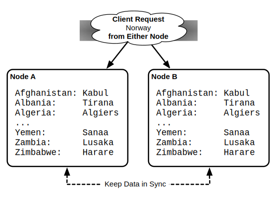
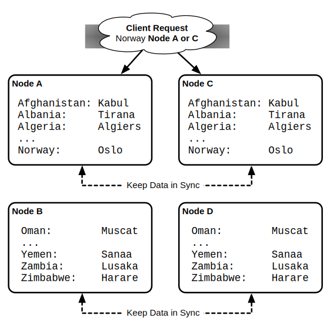
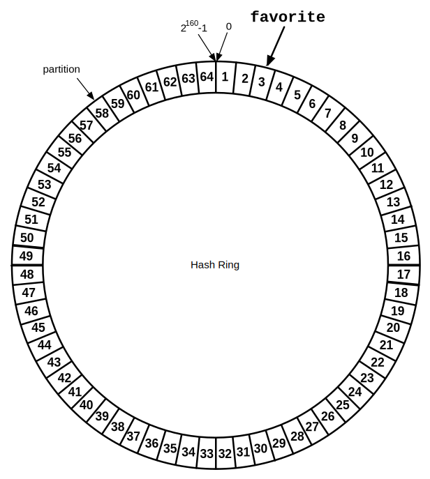
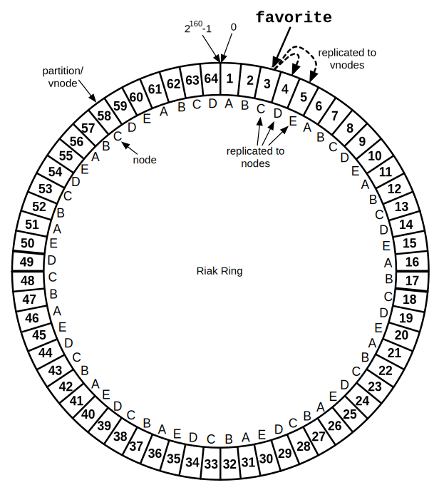
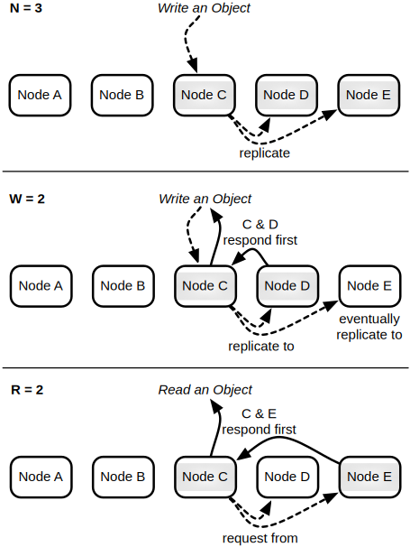

# Concepts

Believe me, dear reader, when I suggest that thinking in a distributed fashion is awkward. When I had first encountered Riak, I was not prepared for some of its more preternatural concepts. Our brains just aren't hardwired to think in a distributed, asynchronous manner. Richard Dawkins coined the term *Middle World*---the serial, rote land humans encounter every day, which exists between the extremes of the very small strangeness of quarks and the vastness of outer space. We don't consider these extremes clearly because we don't encounter them on a daily basis, just like distributed computations and storage. So we create models and tools to bring the physical act of scattered parallel resources in line, on our more ordinary synchronous terms. Where Riak takes great pains to simplify the hard parts, it does not pretend that they don't exist. Just like you can never hope to program at an expert level without any knowledge of memory or CPU management, so too can you never safely develop a highly available clusters without a firm grasp of a few underlying concepts.

## The Landscape

The existence of databases like Riak is the culmination of two basic trends: accessible technology spurring different data requirements, and gaps in the data management market.

First, as we've seen steady improvements in technology along with reductions in cost, vast amounts of computing power and storage are now within the grasp of nearly anyone. Along with our increasingly interconnected world caused by the web and shrinking, cheaper computers (like smartphones), this has catalyzed an exponential growth of data, and a demand for more predictability and speed by savvier users. In other words, more data is being created on the front-end, while more data is being managed on the backend.

Second, relational database management systems (RDBMS) have become focused over the years for a standard set of use-cases, like business intelligence. They were also technically tuned for squeezing performance out of single larger servers, like optimizing disk access, even while cheap commodity (and virtualized) servers made horizontal growth increasingly attractive. As cracks in relational implementations became apparent, custom implementations arose in response to specific problems not originally envisioned by the relational DBs.

These new databases are collected under the moniker *NoSQL*, and Riak is of its ilk.

<h3>Database Models</h3>

Modern databases can be loosely grouped into the ways they represent data. Although I'm presenting 5 major types (the last 4 are considered NoSQL models), these lines are often blurred---you can use some key/value stores as a document store, you can use a relational database to just store key/value data.

<aside id="joins" class="sidebar"><h3>A Quick note on JOINs</h3>

Unlike relational databases, but similar to document and columnar stores, objects cannot be joined by Riak. Client code is responsible for accessing values and merging them, or by other code such as mapreduce.

The ability to easily join data across physical servers is a tradeoff that separates single node databases like relational and graph, from *naturally partitionable* systems like document, columnar, and key/value stores.

This limitation changes how you model data. Relational normalization (organizing data to reduce redundancy) exists for systems that can cheaply join data together per request. However, the ability to spread data across multiple nodes requires a denormalized approach, where some data is duplicated, and computed values may be stored for the sake of performance.
</aside>

  1. **Relational**. Traditional databases usually use SQL to model and query data.
    They are useful for data which can be stored in a highly structured schema, yet
    require flexible querying. Scaling a relational database (RDBMS) traditionally
    occurs by more powerful hardware (vertical growth).
    
    Examples: *PostgreSQL*, *MySQL*, *Oracle*
  2. **Graph**. These exist for highly interconnected data. They excel in
    modeling complex relationships between nodes, and many implementations can
    handle multiple billions of nodes and relationships (or edges and vertices). I tend to include *triplestores* and *object DBs* to be specialized variants.
    
    Examples: *Neo4j*, *Graphbase*, *InfiniteGraph*
  3. **Document**. Document datastores model hierarchical values called documents,
    represented in formats such as JSON or XML, and do not enforce a document schema.
    They generally support distributing across multiple servers (horizontal growth).
    
    Examples: *CouchDB*, *MongoDB*, *Couchbase*
  4. **Columnar**. Popularized by [Google's BigTable](http://research.google.com/archive/bigtable.html),
    this form of database exists to scale across multiple servers, and groups like data into
    column families. Column values can be individually versioned and managed, though families
    are defined in advance, not unlike RDBMS schemas.
    
    Examples: *HBase*, *Cassandra*, *BigTable*
  5. **Key/Value**. Key/Value, or KV stores, are conceptually like hashtables,
    where values are stored and accessed by an immutable key. They range from
    single-server varieties like *Memcached* used for high-speed caching, to
    multi-datacenter distributed systems like *Riak Enterprise*.
    
    Examples: *Riak*, *Redis*, *Voldemort*

### The Fallacies of Distributed Computing

One detour in the land of distributed databases is to understand the condition that they are distributed systems replete with their benefits and handicaps. Engineers at Sun Microsystems created this list of [eight fallacies](http://www.rgoarchitects.com/Files/fallacies.pdf) that engineers new to distributed systems aften fall victim to. They still apply today, even when operating a database like Riak.

1. The network is reliable.
2. Latency is zero.
3. Bandwidth is infinite.
4. The network is secure.
5. Topology doesn't change.
6. There is one administrator.
7. Transport cost is zero.
8. The network is homogeneous.

I always recommend to initiates to take the time to grock this list. Keeping these points in the back of your mind can save days of pain and expense in the future.

## Riak Components

Riak is a Key/Value (KV) database, built from the ground up to safely distribute data across a cluster of physical servers, called nodes. A Riak cluster is also known as a Ring (we'll cover why later).

For now, we'll only consider the concepts required to be a Riak users, and cover operations later.

Riak functions similarly to a very large hashtable. Depending on your background, you may instead call it a map, or dictionary, or object. But the idea is the same: you store a value with an immutable key, and retrieve it later.

<h3>Key and Value</h3>

<!-- replace with an image -->

If Riak were a variable that functioned as a hashtable, you might set the value of your favorite food using the *key* `favorite`.

```javascript
hashtable["favorite"] = "pizza"
```

And retrieve the *value* `pizza` by using the same key as before.

```javascript
food = hashtable["favorite"]
food == "pizza"
```

One day you burn the roof of your mouth. In anger, you decided your favorite food is now `cold pizza`.

```javascript
hashtable["favorite"] = "cold pizza"
```

Successive requests for `favorite` will now return `cold pizza`.

For convenience, we call a key/value pair an *object*. Together our `favorite`/`pizza` pair is referred to as the "`favorite` object", rather than the more verbose "`favorite` key and its value".

<h3>Buckets</h3>

*Buckets* are how Riak allows you to categorizes objects. You can group multiple objects into logical collections, where identical keys will not overlap between buckets.

You can think of buckets as [namespaces](http://en.wikipedia.org/wiki/Namespace_(computer_science\)).

Using our `favorite` example from above, we can specify a favorite food, versus a favorite animal, by using the same key. Unless you're a Midwest farm kid like me, these categories probably won't overlap much.

```javascript
food["favorite"] = "pizza"
animals["favorite"] = "red panda"
```

You could have just named your keys `edible_favorite` and `animal_favorite`, but buckets allow for cleaner key naming, and has other added benefits that I'll outline later.

Buckets are so useful in Riak that all keys must belong to a bucket. There is no global namespace.

In fact in Riak, the true definition of an object key is actually `bucket/key`.

## Replication and Partitions

Distributing data across several nodes is how Riak is able to remain highly available, while tolerant of outages and network partitions. Riak combines two styles of distribution to achieve this: [replication](http://en.wikipedia.org/wiki/Replication_(computing\)) and [partitions](http://en.wikipedia.org/wiki/Partition_(database\)).

<h3>Replication</h3>

**Replication** is the act of duplicating data across multiple servers. Riak replicates by default. 

The obvious benefit of replication is that if one node goes down, nodes that contain replicated data remain available to serve requests. In other words, the system remains *available*.

For example, imagine you have a list of country keys, whose values contain those countries' capitals. If all you do is replicate that data to 2 servers, you would have 2 duplicate databases.

<h5>Node A</h5>

```javascript
"Afghanistan": "Kabul"
"Albania":     "Tirana"
"Algeria":     "Algiers"
...
"Yemen":       "Sanaa"
"Zambia":      "Lusaka"
"Zimbabwe":    "Harare"
```

<h5>Node B</h5>

```javascript
"Afghanistan": "Kabul"
"Albania":     "Tirana"
"Algeria":     "Algiers"
...
"Yemen":       "Sanaa"
"Zambia":      "Lusaka"
"Zimbabwe":    "Harare"
```



The downside with replication is that you are multiplying the amount of storage required for every duplicate. There is also some network overhead with this approach, since values must also be routed to all replicated nodes on write. But there is a more insidious problem with this approach, which I will cover shortly.


<h3>Partitions</h3>

A **partition** is how we divide a set of keys onto separate  physical servers. Rather than duplicate values, we pick one server to exclusively host a range of keys, and the other servers to host remaining non-overlapping ranges.

With partitioning, our total capacity can increase without any big expensive hardware, just lots of cheap commodity servers. If we decided to partition our database into 1000 parts across 1000 nodes, we have (hypothetically) reduced the amount of work any particular server must do to 1/1000th.

For example, if we partition our countries into 2 servers, we might put all countries beginning with letters A-N into Node A, and O-Z into Node B.

<h5>Node A</h5>

```javascript
"Afghanistan": "Kabul"
"Albania":     "Tirana"
"Algeria":     "Algiers"
...
"Norway":      "Oslo"
```

<h5>Node B</h5>

```javascript
"Oman":        "Muscat"
...
"Yemen":       "Sanaa"
"Zambia":      "Lusaka"
"Zimbabwe":    "Harare"
```

There is a bit of overhead the partition approach. Some service must keep track of what range of values live on which node. A requesting application must know that the key `Spain` will be routed to Node B, not Node A.

There's also another downside. Unlike replication, simple partitioning of data actually *decreases* uptime. If one node goes down, that entire partition of data is unavailable. This is why Riak uses both replication and partitioning.


<h3>Replication+Partitions</h3>

Since partitions allow us to increase capacity, and replication improves availability, Riak combines them. We partition data across multiple nodes, as well as replicate that data into multiple nodes.

Where our previous example partitioned data into 2 nodes, we can replicate each of those partitions into 2 more nodes, for a total of 4.

<h5>Nodes A & C</h5>

```javascript
"Afghanistan": "Kabul"
"Albania":     "Tirana"
"Algeria":     "Algiers"
...
"Norway":      "Oslo"
```

<h5>Nodes B & D</h5>

```javascript
"Oman":        "Muscat"
...
"Yemen":       "Sanaa"
"Zambia":      "Lusaka"
"Zimbabwe":    "Harare"
```

Our server count has increased, but so has our capacity and reliability. If you're designing a horizontally scalable system by partitioning data, you must deal with replicating those partitions.

The Riak team suggests a minimum of 5 nodes for a Riak cluster, and replicating to 3 nodes (this setting is called `n_val`, for the number of *nodes* on which to replicate each object).



<!-- If the odds of a node going down on any day is 1%, then the odds of any server going down each day when you have 100 of them is about (1-(0.99^100)) 63%. For sufficiently large systems, servers going down are no longer edge-cases. They become regular cases that must be planned for, and designed into your system.
-->

<h3>The Ring</h3>

Riak follows the *consistent hashing* technique, that conceptually maps objects to the edge of a circle or ring. It has the benefit of reducing the amount of data that must be rebalanced when a node goes down.

Riak partitions are not mapped alphabetically (as we used in the examples above), but instead, a partition marks a range of key hashes (SHA-1 function applied to a key). The maximum hash value is 2^160, and divided into some number of partitions---64 partitions by default (the Riak config setting is `ring_creation_size`).

Let's walk through what all that means. If you have the key `favorite`, applying the SHA-1 algorithm would return `dc2b 258d 7221 3f8d 05d1 5973 a66d c156 847b 83f4` in hexadecimal. With 64 partitions, each partition has 1/64 of the 2^160 possible values, making the first partition range from 0 to 2^154-1, the second range is 2^154 to 2*2^154-1, and so on, up to the last partition 63*2^154-1 to 2^160-1.

<!-- V=lists:sum([lists:nth(X, H)*math:pow(16, X-1) || X <- lists:seq(1,string:len(H))]) / 64. -->
<!-- V / 2.28359630832954E46. // 2.2.. is 2^154 -->

We won't do all of the math, but trust me when I say `favorite` falls within the range of partition 3.

If we visualize our 64 partitions as a ring, `favorite` falls here.



You may have wondered, "Didn't he say that Riak suggests a minimum of 5 nodes? How can we put 64 partitions on 5 nodes?" We just give each node more than one partition, which Riak calls a *vnode*, or *virtual node*.

We count around the ring of vnodes in order, assigning each node to the next available vnode, until all vnodes are accounted for. So partition/vnode 1 would be owned by Node A, vnode 2 owned by Node B, up to vnode 5 owned by Node E. Then we continue by giving Node A vnode 6, Node B vnode 7, and so on, until our vnodes have been exhausted, leaving us this list.

* A = [1,6,11,16,21,26,31,36,41,46,51,56,61]
* B = [2,7,12,17,22,27,32,37,42,47,52,57,62]
* C = [3,8,13,18,23,28,33,38,43,48,53,58,63]
* D = [4,9,14,19,24,29,34,39,44,49,54,59,64]
* E = [5,10,15,20,25,30,35,40,45,50,55,60]

So far we've partitioned the ring, but what about replication? When we write a new value to Riak, it will replicate the result in some number of nodes, defined by a setting called `n_val`. In our 5 node cluster it defaults to 3.

So when we write our `favorite` object to vnode 3, it will be replicated to vnodes 4 and 5. This places the object in physical nodes C, D, and E. Once the write is complete, even if node C crashes, the value is still available on 2 other nodes. This is the secret of Riak's high availability.

We can visualize the Ring with its vnodes, managing nodes, and where `favorite` will go.



The Ring is more than just a circular array of hash partitions. It's also a system of metadata that gets copied to every node. Each node is aware of every other node in the cluster, which nodes own which vnodes, and other system data.

Armed with this information, requests for data can target any node. It will horizontally access data from the proper nodes, and return the result.

## Practical Tradeoffs

So far we've covered the good parts of partitioning and replication: highly available when responding to requests, and inexpensive capacity scaling on commodity hardware. With the clear benefits of horizontal scaling, why is it not more common?

<h3>CAP Theorem</h3>

Classic RDBMS databases are *write consistent*. Once a write is confirmed, successive reads are guaranteed to return the newest value. If I save the value `cold pizza` to my key `favorite`, every future read will consistently return `cold pizza` until I change it.

<!-- The very act of placing our data in multiple servers carries some inherent risk. -->

But when values are distributed, *consistency* might not be guaranteed. In the middle of an object's replication, two servers could have different results. When we update `favorite` to `cold pizza` on one node, another node might contain the older value `pizza`, because of a network connectivity problem. If you request the value of `favorite` on either side of a network partition, two different results could possibly be returned---the database is inconsistent.

We do have an alternative choice. Rather than lose consistency, you could chose to lose *availability*. We may, for instance, decide to lock the entire database during a write, and simply refuse to serve requests until that value has been replicated to all relevant nodes. Clients have to wait while their results can be brought into a consistent state (ensuring all replicas will return the same value) or fail if the nodes have trouble communicating. For many high-traffic read/write use-cases, like an online shopping cart where even minor delays will cause people to just shop elsewhere, this is not an acceptable sacrifice.

This tradeoff is known as Brewer's CAP theorem. CAP loosely states that you can have a C (consistent), A (available), or P (partition-tolerant) system, but you can only choose 2. Assuming your system is distributed, you're going to be partition-tolerant, meaning, that your network can tolerate packet loss. If a network partition occurs between nodes, your servers still run.

<!-- A fourth concept not covered by the CAP theorem, latency, is especially important here. -->

<aside class="sidebar"><h3>Not Quite C</h3>

Strictly speaking, Riak has a tunable latency-availability tradeoff. The concession is similar to tuning A/C. To decrease read/write latency effectively improves the odds of consistency, by making requests unavailable in certain circumstances in the way a CP system would.

Currently, no setting can make Riak truely CP in the general case, but features for a few strict cases are being researched.
</aside>

<h3>N/R/W</h3>

A question the CAP theorem demands you answer with a distributed system is: do I give up strict consistency, or give up ensured availability? If a request comes in, do I lock out requests until I can enforce consistency across the nodes? Or do I serve requests at all costs, with the caveat that the database may become inconsistent?

Riak's solution is based on Amazon Dynamo's novel approach of a *tunable* AP system. It takes advantage of the fact that, though the CAP theorem is true, you can choose what kind of tradeoffs you're willing to make. Riak is highly available to serve requests, with the ability to tune its level of availability (nearing, but never quite reaching, full consistency).

Riak allows you to choose how many nodes you want to replicate an object to, and how many nodes must be written to or read from per request. These values are settings labeled `n_val` (the number of nodes to replicate to), `r` (the number of nodes read from before returning), and `w` (the number of nodes written to before considered successful).

A thought experiment might help clarify.



<h4>N</h4>

With our 5 node cluster, having an `n_val=3` means values will eventually replicate to 3 nodes, as we've discussed above. This is the *N value*. You can set the other values to be all `n_val` nodes with the shorthand `all`.

<h4>W</h4>

But you may not wish to wait for all nodes to be written to before returning. You can choose to write to all 3 (`w=3` or `w=all`), which means my values are more likely to be consistent, or choose to write only 1 (`w=1`), and allow the remaining 2 nodes to write asynchronously, but return a response quicker. This is the *W value*.

In other words, setting `w=all` would help ensure your system was more likely to be consistent, at the expense of waiting longer, with a chance that your write would fail if fewer than 3 nodes were available (meaning, over half of your total servers are down).

<h4>R</h4>

The same goes for reading. To ensure you have the most recent value, you can read from all 3 nodes containing objects (`r=all`). Even if only 1 of 3 nodes has the most recent value, we can compare all nodes against each other and choose the latest one, thus ensuring some consistency. Remember when I mentioned that RDBMS databases were *write consistent*? This is close to *read consistency*. Just like `w=all`, however, the read will fail unless 3 nodes are available to be read. Finally, if you only want to quickly read any value, `r=1` has low latency, and is likely consistent if `w=all`.

In general terms, the N/R/W values are Riak's way of allowing you to trade less consistency for more availability.

<h3>Vector Clock</h3>

If you've followed thus far, I only have one more conceptual wrench to throw at you. I wrote earlier that with `r=all`, we can "compare all nodes against each other and choose the latest one." But how do we know which is the latest value? This is where Vector Clocks come into play.

Vector clocks measure a sequence of events, just like a normal clock. But since we can't reasonably keep dozens, or hundreds, or thousands of servers in sync (without really exotic hardware, like geosynchronized atomic clocks, or quantum entanglement), we instead keep track of how, and who, modifies an object. It's as easy as keeping a vector (or array) of which clients change an object in which order. That way we can tell if an object is being updated or if a write conflict has occurred.

Let's use our `favorite` example again, but this time we have 3 people trying to come to a consensus on their favorite food: Aaron, Britney, and Carrie. We'll track the value each has chosen, and the relevant vector clock, or *vclock*.

When Aaron sets the `favorite` object to `pizza`, a hypothetical vector clock could contain his name, and the number of updates he's performed.

```
vclock: [Aaron: 1]
value:  pizza
```

Britney now comes along, and reads `favorite`, but decides to update `pizza` to `cold pizza`. When using vclocks, she must provide the vclock returned from the request she wants to update. This is how Riak can help ensure you're updating a previous value, and not merely overwriting with your own.

```
vclock: [Aaron: 1, Britney: 1]
value:  cold pizza
```

At the same time as Britney, Carrie decides that pizza was a terrible choice, and tried to change Aaron's value to `lasagna`.

```
vclock: [Aaron: 1, Carrie: 1]
value:  lasagna
```

This presents a problem, because there are now two vector clocks in play that diverge from `[Aaron: 1]`. So Riak can store both values and both vclocks.

Later in the day Britney checks again, but this time she gets the two conflicting values, with two vclocks.

```
vclock: [Aaron: 1, Britney: 1]
value:  cold pizza
---
vclock: [Aaron: 1, Carrie: 1]
value:  lasagna
```

It's clear that a decision must be made. Since two people generally agreed on `pizza`, Britney resolves the conflict by deciding on Aaron's original `pizza` value, and updating with her vclock.

```
vclock: [Aaron: 1, Britney: 2]
value:  pizza
```

Now we are back to the simple case, where requesting the value of `favorite` will just return the agreed upon `pizza`.

Beyond the ability for vector clocks to provide a reasonable history of updates, is also used when reading values from two conflicting nodes. This is how we can compare the reads of multiple nodes and decide upon the most recent version.

If you're a programmer, you may notice that this is not unlike a version control system, like **git**, where conflicting branches may require manual merging into one.

The Riak mechanism uses internal hashing and system clocks to stop unbounded vclock growth. We'll dig into more details of Riak's vclocks in the next chapter.

<h3>Riak and ACID</h3>

<aside id="acid" class="sidebar"><h3>Distributed Relational is Not Exempt</h3>

You may have wondered why we don't just distribute a standard relational database. After all, MySQL has the ability to cluster, and it's ACID, right? Yes and no.

A single node in the cluster is ACID, but the entire cluster is not without a loss of availability, and often worse, increased latency. When you write to a primary node, and a secondary node is replicated to, a network partition can occur. To remain available, the secondary will not be in sync (eventually consistent). Have you ever lost data between a failure and a backup? Same idea.

Or, the entire transaction can fail, making the whole cluster unavailable. Even ACID databases cannot escape the scourge of CAP.
</aside>

Unlike single node databases like Neo4j or PostgreSQL, Riak does not support *ACID* transactions. Locking across multiple servers would kill write availability, and equally concerning, increase latency. While ACID transactions promise *Atomicity*, *Consistency*, *Isolation*, and *Durability*---Riak and other NoSQL databases follow *BASE*, or *Basically Available*, *Soft state*, *Eventually consistent*.

The BASE acronym was meant as shorthand for the goals of non-ACID-transactional databases like Riak. It is an acceptance that distribution is never perfect (basically available), all data is in flux (soft state), and that true consistency is generally untenable (eventually consistent).

Be wary if anyone promises highly available distributed ACID transactions---it's usually couched in some diminishing adjective or caveat like *row transactions*, or *per node transactions*, which basically mean *not transactional* in terms you would normally use to define it.

As your server count grows---especially as you introduce multiple datacenters---the odds of partitions and node failures drastically increase. My best advice is to design for it upfront.

## Wrapup

Riak is designed to bestow a range of real-world benefits, but equally, to handle the fallout of wielding such power. Consistent hashing and vnodes are an elegant solution to horizontally scaling across servers. N/R/W allows you to dance with the CAP theorem by fine-tuning against its constraints. And vector clocks allow another step closer to true consistency by allowing you to manage conflicts that will occur at high load.

We'll cover other technical concepts as needed, like the gossip protocol, hinted handoff, or read-repair.

Next we'll go through Riak as a user. We'll check out lookups, take advantage of write hooks, and alternative query options like secondary indexing, search, and mapreduce.
