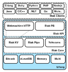
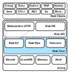
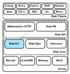
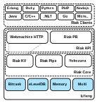

# Operators

<!-- What Riak is famous for is its simplicity to operate and stability at increasing scales. -->

In some ways, Riak is downright mundane in its role as the easiest
NoSQL database to operate. Want more servers? Add them. A network
cable is cut at 2am? Deal with it after a few more hours of
sleep. Understanding this integral part of your application stack is
still important, however, despite Riak's reliability.

We've covered the core concepts of Riak, and I've provided a taste of
how to use it, but there is more to the database than that. There are
details you should know if you plan on operating a Riak cluster of
your own.

## Clusters

Up to this point you've conceptually read about "clusters" and the "Ring" in
nebulous summations. What exactly do we mean, and what are the practical
implications of these details for Riak developers and operators?

A *cluster* in Riak is a managed collection of nodes that share a common Ring.

<h3>The Ring</h3>

*The Ring* in Riak is actually a two-fold concept.

Firstly, the Ring represents the consistent hash partitions (the partitions
managed by vnodes). This partition range is treated as circular, from 0 to
2^160-1 back to 0 again. (If you're wondering, yes this means that we are
limited to 2^160 nodes, which is a limit of a 1.46 quindecillion, or
`1.46 x 10^48`, node cluster. For comparison, there are only `1.92 x 10^49`
[silicon atoms on Earth](http://education.jlab.org/qa/mathatom_05.html).)

When we consider replication, the N value defines how many nodes an object is
replicated to. Riak makes a best attempt at spreading that value to as many
nodes as it can, so it copies to the next N adjacent nodes, starting with the
primary partition and counting around the Ring, if it reaches the last
partition, it loops around back to the first one.

Secondly, the Ring is also used as a shorthand for describing the state of the
circular hash ring I just mentioned. This Ring (aka *Ring State*) is a
data structure that gets passed around between nodes, so each knows the state
of the entire cluster. Which node manages which vnodes? If a node gets a
request for an object managed by other nodes, it consults the Ring and forwards
the request to the proper nodes. It's a local copy of a contract that all of
the nodes agree to follow.

Obviously, this contract needs to stay in sync between all of the nodes. If a node is permanently taken
offline or a new one added, the other nodes need to readjust, balancing the partitions around the cluster,
then updating the Ring with this new structure. This Ring state gets passed between the nodes by means of
a *gossip protocol*.

<h3>Gossip</h3>

The *gossip protocol* is Riak's method of keeping all nodes current on the state of the Ring. If a node goes up or down, that information is propagated to other nodes. Periodically, nodes will also send their status to a random peer for added consistency.

Propagating changes in Ring is an asynchronous operation, and can take a couple minutes depending on
Ring size.

<!-- Transfers will not start while a gossip is in progress. -->


Currently, it is not possible to change the number of vnodes of a cluster. This
means that you *must have an idea of how large you want your cluster to grow in a single
datacenter*. Although a basic install starts with 64 vnodes, if you plan any cluster larger
than 6 or so servers you should increase vnodes to `256` or `1024`.

The number of vnodes must be a power of 2 (eg. `64`, `256`, `1024`).

<aside class="sidebar"><h3>Dynamic Ring resizing</h3>

A great deal of effort has been made toward being able to change the
number of vnodes, so by the time you read this, it is entirely
possible that Basho has released a version of Riak that allows it.

</aside>

<h3>How Replication Uses the Ring</h3>

Even if you are not a programmer, it's worth taking a look at this Ring example. It's also worth
remembering that partitions are managed by vnodes, and in conversation are sometimes interchanged,
though I'll try to be more precise here.

Let's start with Riak configured to have 8 partitions, which are set via `ring_creation_size`
in the `etc/app.config` file (we'll dig deeper into this file later).

```bash
 %% Riak Core config
 {riak_core, [
               ...
               {ring_creation_size, 8},
```

In this example, I have a total of 4 Riak nodes running on `A@10.0.1.1`,
`B@10.0.1.2`, `C@10.0.1.3`, and `D@10.0.1.4`, each with two partitions (and thus vnodes)

Riak has the amazing, and dangerous, `attach` command that attaches an Erlang console to a live Riak
node, with access to all of the Riak modules.

The `riak_core_ring:chash(Ring)` function extracts the total count of partitions (8), with an array
of numbers representing the start of the partition, some fraction of the 2^160 number, and the node
name that represents a particular Riak server in the cluster.

```
$ bin/riak attach
(A@10.0.1.1)1> {ok,Ring} = riak_core_ring_manager:get_my_ring().
(A@10.0.1.1)2> riak_core_ring:chash(Ring).
{8,
 [{0,'A@10.0.1.1'},
  {182687704666362864775460604089535377456991567872, 'B@10.0.1.2'},
  {365375409332725729550921208179070754913983135744, 'C@10.0.1.3'},
  {548063113999088594326381812268606132370974703616, 'D@10.0.1.4'},
  {730750818665451459101842416358141509827966271488, 'A@10.0.1.1'},
  {913438523331814323877303020447676887284957839360, 'B@10.0.1.2'},
  {1096126227998177188652763624537212264741949407232, 'C@10.0.1.3'},
  {1278813932664540053428224228626747642198940975104, 'D@10.0.1.4'}]}
```

To discover which partition the bucket/key `food/favorite` object would be stored in, for example,
we execute `riak_core_util:chash_key({<<"food">>, <<"favorite">>})` and get a wacky 160 bit Erlang
number we named `DocIdx` (document index).

Just to illustrate that Erlang binary value is a real number, the next line makes it a more
readable format, similar to the ring partition numbers.

```
(A@10.0.1.1)3> DocIdx = riak_core_util:chash_key({<<"food">>, <<"favorite">>}).
<<80,250,1,193,88,87,95,235,103,144,152,2,21,102,201,9,156,102,128,3>>

(A@10.0.1.1)4> <<I:160/integer>> = DocIdx. I.
462294600869748304160752958594990128818752487427
```

With this `DocIdx` number, we can order the partitions, starting with first number greater than
`DocIdx`. The remaining partitions are in numerical order, until we reach zero, then
we loop around and continue to exhaust the list.

```
(A@10.0.1.1)5> Preflist = riak_core_ring:preflist(DocIdx, Ring).
[{548063113999088594326381812268606132370974703616, 'D@10.0.1.4'},
 {730750818665451459101842416358141509827966271488, 'A@10.0.1.1'},
 {913438523331814323877303020447676887284957839360, 'B@10.0.1.2'},
 {1096126227998177188652763624537212264741949407232, 'C@10.0.1.3'},
 {1278813932664540053428224228626747642198940975104, 'D@10.0.1.4'},
 {0,'A@10.0.1.1'},
 {182687704666362864775460604089535377456991567872, 'B@10.0.1.2'},
 {365375409332725729550921208179070754913983135744, 'C@10.0.1.3'}]
```

So what does all this have to do with replication? With the above list, we simply replicate a write
down the list N times. If we set N=3, then the `food/favorite` object will be written to
the `D@10.0.1.4` node's partition `5480631...` (I truncated the number here),
`A@10.0.1.1` partition `7307508...`, and `B@10.0.1.2` partition `9134385...`.

If something has happened to one of those nodes, like a network split
(confusingly also called a partition---the "P" in "CAP"), the remaining
active nodes in the list become candidates to hold the data.

So if the node coordinating the write could not reach node
`A@10.0.1.1` to write to partition `7307508...`, it would then attempt
to write that partition `7307508...` to `C@10.0.1.3` as a fallback
(it's the next node in the list preflist after the 3 primaries).

The way that the Ring is structured allows Riak to ensure data is always
written to the appropriate number of physical nodes, even in cases where one
or more physical nodes are unavailable. It does this by simply trying the next
available node in the preflist.

<h3>Hinted Handoff</h3>

When a node goes down, data is replicated to a backup node. This is not a
permanent solution, but merely a band-aid. Riak periodically triggers vnodes
to check if they reside on the correct physical node. A managing process on
each physical node is responsible for handing off these vnodes to the target
node, if it is reachable.

As long as the temporary node cannot connect to the primary, it will continue
to access writes and reads on behalf of its incapacitated brethren.

Hinted handoff not only helps Riak achieve high availability, it also facilitates
data migration when physical nodes are added or removed from the Ring.

## Managing a Cluster

Now that we have a grasp of the general concepts of Riak, how users query it,
and how Riak manages replication, it's time to build a cluster. It's so easy to
do, in fact, I didn't bother discussing it for most of this book.

<h3>Install</h3>

The Riak docs have all of the information you need to [Install](http://docs.basho.com/riak/latest/tutorials/installation/) it per operating system. The general sequence is:

1. Install Erlang
2. Get Riak from a package manager (*a la* `apt-get` or Homebrew), or build from source (the results end up under `rel/riak`, with the binaries under `bin`).
3. Run `riak start`

Install Riak on four or five nodes---five being the recommended safe minimum for production. Fewer nodes are OK during software development and testing.

<h3>Command Line</h3>

Most Riak operations can be performed though the command line. We'll concern ourselves with two commands: `riak` and `riak-admin`.

<h4>riak</h4>

Simply typing the `riak` command will give a usage list, although not a
terribly descriptive one.

```bash
Usage: riak {start|stop|restart|reboot|ping|console|\
             attach|chkconfig|escript|version}
```

Most of these commands are self explanatory, once you know what they mean. `start` and `stop` are simple enough. `restart` means to stop the running node and restart it inside of the same Erlang VM (virtual machine), while `reboot` will take down the Erlang VM and restart everything.

You can print the current running `version`. `ping` will return `pong` if the server is in good shape, otherwise you'll get the *just-similar-enough-to-be-annoying* response `pang` (with an *a*), or a simple `Node *X* not responding to pings` if it's not running at all.

`chkconfig` is useful if you want to ensure your `etc/app.config` is not broken
(that is to say, it's parsable). I mentioned `attach` briefly above, when
we looked into the details of the Ring---it attaches a console to the local
running Riak server so you can execute Riak's Erlang code. `escript` is similar
to `attach`, except you pass in script file of commands you wish to run automatically.

<!--
If you want to build this on a single dev machine, here is a truncated guide.
Download the Riak source code, then run the following:
make deps
make devrel
for i in {1..5}; do dev/dev$i/bin/riak start; done
for i in {1..5}; do dev/dev$i/bin/riak ping; done
for i in {2..5}; do dev/dev$i/bin/riak-admin cluster join A@10.0.1.1; done
dev/dev1/bin/riak-admin cluster plan
dev/dev1/bin/riak-admin cluster commit
You should now have a 5 node cluster running locally.
-->

<h4>riak-admin</h4>

The `riak-admin` command is the meat operations, the tool you'll use most often. This is where you'll join nodes to the Ring, diagnose issues, check status, and trigger backups.

```bash
Usage: riak-admin { cluster | join | leave | backup | restore | test |
                    reip | js-reload | erl-reload | wait-for-service |
                    ringready | transfers | force-remove | down |
                    cluster-info | member-status | ring-status | vnode-status |
                    diag | status | transfer-limit |
                    top [-interval N] [-sort reductions|memory|msg_q] [-lines N] }
```

Many of these commands are deprecated, and many don't make sense without a
cluster, but a few we can look at now.

`status` outputs a list of information about this cluster. It's mostly the same information you can get from getting `/stats` via HTTP, although the coverage of information is not exact (for example, riak-admin status returns `disk`, and `/stats` returns some computed values like `gossip_received`).

```
$ riak-admin status
1-minute stats for 'A@10.0.1.1'
-------------------------------------------
vnode_gets : 0
vnode_gets_total : 2
vnode_puts : 0
vnode_puts_total : 1
vnode_index_reads : 0
vnode_index_reads_total : 0
vnode_index_writes : 0
vnode_index_writes_total : 0
vnode_index_writes_postings : 0
vnode_index_writes_postings_total : 0
vnode_index_deletes : 0
...
```

Adding JavaScript or Erlang files to Riak (as we did in the
[developers chapter](#developers) ) are not usable by the nodes until they are informed
about them by the `js-reload` or `erl-reload` command.

`riak-admin` also provides a little `test` command, so you can perform a read/write cycle
to a node, which I find useful for testing a client's ability to connect, and the node's
ability to write.

Finally, `top` is an analysis command checking the Erlang details of a particular node in
real time. Different processes have different process ids (Pids), use varying amounts of memory,
queue up so many messages at a time (MsgQ), and so on. This is useful for advanced diagnostics,
and is especially useful if you know Erlang, or seek help from other users, the Riak team, or
Basho.


<h3>Making a Cluster</h3>

With several solitary nodes running---assuming they are networked and are able to communicate to
each other---launching a cluster is the simplest part.

Executing the `cluster` command will output a descriptive set of commands.

```
$ riak-admin cluster
The following commands stage changes to cluster membership. These commands
do not take effect immediately. After staging a set of changes, the staged
plan must be committed to take effect:

   join <node>                    Join node to the cluster containing <node>
   leave                          Have this node leave the cluster and shutdown
   leave <node>                   Have <node> leave the cluster and shutdown

   force-remove <node>            Remove <node> from the cluster without
                                  first handing off data. Designed for
                                  crashed, unrecoverable nodes

   replace <node1> <node2>        Have <node1> transfer all data to <node2>,
                                  and then leave the cluster and shutdown

   force-replace <node1> <node2>  Reassign all partitions owned by <node1> to
                                  <node2> without first handing off data, and
                                  remove <node1> from the cluster.

Staging commands:
   plan                           Display the staged changes to the cluster
   commit                         Commit the staged changes
   clear                          Clear the staged changes
```

To create a new cluster, you must `join` another node (any will do). Taking a
node out of the cluster uses `leave` or `force-remove`, while swapping out
an old node for a new one uses `replace` or `force-replace`.

I should mention here that using `leave` is the nice way of taking a node
out of commission. However, you don't always get that choice. If a server
happens to explode (or simply smoke ominously), you don't need its approval
to remove it from the cluster, but can instead mark it as `down`.

But before we worry about removing nodes, let's add some first.

```bash
$ riak-admin cluster join A@10.0.1.1
Success: staged join request for 'B@10.0.1.2' to 'A@10.0.1.1'
$ riak-admin cluster join A@10.0.1.1
Success: staged join request for 'C@10.0.1.3' to 'A@10.0.1.1'
```

<aside class="sidebar"><h3>Don't Wait Too Long</h3>

You should always keep in mind the general pattern Riak
follows when you make a change to the cluster:

*Join/Leave/Down -> Commit -> Ring state change -> Gossiped -> Hinted handoff*

Large amounts of data can take time and cause system strain to transfer, so
don't wait until it's too late to grow.
</aside>

Once all changes are staged, you must review the cluster `plan`. It will give you
all of the details of the nodes that are joining the cluster, and what it
will look like after each step or *transition*, including the `member-status`,
and how the `transfers` plan to handoff partitions.

Below is a simple plan, but there are cases when Riak requires multiple
transitions to enact all of your requested actions, such as adding and removing
nodes in one stage.

```bash
$ riak-admin cluster plan
=============================== Staged Changes ==============
Action         Nodes(s)
-------------------------------------------------------------
join           'B@10.0.1.2'
join           'C@10.0.1.3'
-------------------------------------------------------------


NOTE: Applying these changes will result in 1 cluster transition

#############################################################
                         After cluster transition 1/1
#############################################################

================================= Membership ================
Status     Ring    Pending    Node
-------------------------------------------------------------
valid     100.0%     34.4%    'A@10.0.1.1'
valid       0.0%     32.8%    'B@10.0.1.2'
valid       0.0%     32.8%    'C@10.0.1.3'
-------------------------------------------------------------
Valid:3 / Leaving:0 / Exiting:0 / Joining:0 / Down:0

WARNING: Not all replicas will be on distinct nodes

Transfers resulting from cluster changes: 42
  21 transfers from 'A@10.0.1.1' to 'C@10.0.1.3'
  21 transfers from 'A@10.0.1.1' to 'B@10.0.1.2'
```

Making changes to cluster membership can be fairly resource intensive, so Riak defaults to
only performing 2 transfers at a time. You can choose to alter this `transfer-limit` from
the `riak-admin`, but bear in mind the higher the number, the greater normal operations
will be impinged.

At this point, if you find a mistake in the plan, you have the chance to `clear` it and try
again. When you are ready, `commit` the cluster to enact the plan.

```
$ dev1/bin/riak-admin cluster commit
Cluster changes committed
```

Without any data, adding a node to a cluster is a quick operation. However, with large amounts of
data to be transferred to a new node, it can take quite a while before the new node is ready to use.

<h3>Status Options</h3>

To check on a launching node's progress, you can run the `wait-for-service` command. It will
output the status of the service and stop when it's finally up. In this example, we check
the `riak_kv` service.

```
$ riak-admin wait-for-service riak_kv C@10.0.1.3
riak_kv is not up: []
riak_kv is not up: []
riak_kv is up
```

You can get a list of available services with the `services` command.

You can also see if the whole ring is ready to go with `ringready`. If the nodes do not agree
on the state of the ring, it will output `FALSE`, otherwise `TRUE`.

```
$ riak-admin ringready
TRUE All nodes agree on the ring ['A@10.0.1.1','B@10.0.1.2',
                                  'C@10.0.1.3']
```

For a more complete view of the status of the nodes in the ring, you can check out `member-status`.

```bash
$ riak-admin member-status
================================= Membership ================
Status     Ring    Pending    Node
-------------------------------------------------------------
valid      34.4%      --      'A@10.0.1.1'
valid      32.8%      --      'B@10.0.1.2'
valid      32.8%      --      'C@10.0.1.3'
-------------------------------------------------------------
Valid:3 / Leaving:0 / Exiting:0 / Joining:0 / Down:0
```

And for more details of any current handoffs or unreachable nodes, try `ring-status`. It
also lists some information from `ringready` and `transfers`. Below I turned off the C
node to show what it might look like.

```bash
$ riak-admin ring-status
================================== Claimant =================
Claimant:  'A@10.0.1.1'
Status:     up
Ring Ready: true

============================== Ownership Handoff ============
Owner:      dev1 at 127.0.0.1
Next Owner: dev2 at 127.0.0.1

Index: 182687704666362864775460604089535377456991567872
  Waiting on: []
  Complete:   [riak_kv_vnode,riak_pipe_vnode]
...

============================== Unreachable Nodes ============
The following nodes are unreachable: ['C@10.0.1.3']

WARNING: The cluster state will not converge until all nodes
are up. Once the above nodes come back online, convergence
will continue. If the outages are long-term or permanent, you
can either mark the nodes as down (riak-admin down NODE) or
forcibly remove the nodes from the cluster (riak-admin
force-remove NODE) to allow the remaining nodes to settle.
```

If all of the above information options about your nodes weren't enough, you can
list the status of each vnode per node, via `vnode-status`. It'll show each
vnode by its partition number, give any status information, and a count of each
vnode's keys. Finally, you'll get to see each vnode's backend type---something I'll
cover in the next section.

```bash
$ riak-admin vnode-status
Vnode status information
-------------------------------------------

VNode: 0
Backend: riak_kv_bitcask_backend
Status:
[{key_count,0},{status,[]}]

VNode: 91343852333181432387730302044767688728495783936
Backend: riak_kv_bitcask_backend
Status:
[{key_count,0},{status,[]}]

VNode: 182687704666362864775460604089535377456991567872
Backend: riak_kv_bitcask_backend
Status:
[{key_count,0},{status,[]}]

VNode: 274031556999544297163190906134303066185487351808
Backend: riak_kv_bitcask_backend
Status:
[{key_count,0},{status,[]}]

VNode: 365375409332725729550921208179070754913983135744
Backend: riak_kv_bitcask_backend
Status:
[{key_count,0},{status,[]}]
...
```

Some commands we did not cover are either deprecated in favor of their `cluster`
equivalents (`join`, `leave`, `force-remove`, `replace`, `force-replace`), or
flagged for future removal `reip` (use `cluster replace`).

The last command is `diag`, which requires a [Riaknostic](http://riaknostic.basho.com/)
installation to give you more diagnostic tools.

I know this was a lot to digest, and probably pretty dry. Walking through command
line tools usually is. There are plenty of details behind many of the `riak-admin`
commands, too numerous to cover in such a short book. I encourage you to toy around
with them on your own installation.


## How Riak is Built

It's difficult to label Riak as a single project. It's probably more correct to think of
Riak as the center of gravity for a whole system of projects. As we've covered
before, Riak is built on Erlang, but that's not the whole story. It's more correct
to say Riak is fundamentally Erlang, with some pluggable native C code components
(like leveldb), Java (Yokozuna), and even JavaScript (for Mapreduce or commit hooks).


The way Riak stacks technologies is a good thing to keep in mind, in order to make
sense of how to configure it properly.

<h3>Erlang</h3>



When you fire up a Riak node, it also starts up an Erlang VM (virtual machine) to run
and manage Riak's processes. These include vnodes, process messages, gossips, resource
management and more. The Erlang operating system process is found as a `beam.smp`
command with many, many arguments.

These arguments are configured through the `etc/vm.args` file. There are a few
settings you should pay special attention to.

```bash
$ ps -o command | grep beam
/riak/erts-5.9.1/bin/beam.smp \
-K true \
-A 64 \
-W w -- \
-root /riak \
-progname riak -- \
-home /Users/ericredmond -- \
-boot /riak/releases/1.2.1/riak \
-embedded \
-config /riak/etc/app.config \
-pa ./lib/basho-patches \
-name A@10.0.1.1 \
-setcookie testing123 -- \
console
```

The `name` setting is the name of the current Riak node. Every node in your cluster
needs a different name. It should have the IP address or dns name of the server
this node runs on, and optionally a different prefix---though some people just like
to name it *riak* for simplicity (eg: `riak@node15.myhost`).

The `setcookie` parameter is a setting for Erlang to perform inter-process
communication (IPC) across nodes. Every node in the cluster must have the same
cookie name. I recommend you change the name from `riak` to something a little
less likely to accidentally conflict, like `hihohihoitsofftoworkwego`.

My `vm.args` starts with this:

```
## Name of the riak node
-name A@10.0.1.1

## Cookie for distributed erlang.  All nodes in the
## same cluster should use the same cookie or they
## will not be able to communicate.
-setcookie testing123
```

Continuing down the `vm.args` file are more Erlang settings, some environment
variables that are set up for the process (prefixed by `-env`), followed by
some optional SSL encryption settings.

<h3>riak_core</h3>



If any single component deserves the title of "Riak proper", it would be
*Riak Core*. Core, and implementations are responsible for managing the
partitioned keyspace, launching and supervising vnodes, preference list
building, hinted handoff, and things that aren't related specifically to
client interfaces, handling requests, or storage.

Riak Core, like any project, has some hard coded values (for example, how
protocol buffer messages are encoded in binary). However, many values
can be modified to fit your use-case. The majority of this configuration
occurs under `app.config`. This file is Erlang code, so commented lines
begin with a `%` character.

The `riak_core` configuration section allows you to change the options in
this project. This handles basic settings, like files/directories where
values are stored or to be written to, the number of partitions/vnodes
in the cluster (`ring_creation_size`), and several port options.

```bash
%% Riak Core config
{riak_core, [
    %% Default location of ringstate
    {ring_state_dir, "./data/ring"},

    %% Default ring creation size.  Make sure it is a power of 2,
    %% e.g. 16, 32, 64, 128, 256, 512 etc
    %{ring_creation_size, 64},

    %% http is a list of IP addresses and TCP ports that
    %% the Riak HTTP interface will bind.
    {http, [ {"127.0.0.1", 8098 } ]},

    %% https is a list of IP addresses and TCP ports that
    %% the Riak HTTPS interface will bind.
    %{https, [{ "127.0.0.1", 8098 }]},

    %% Default cert and key locations for https can be
    %% overridden with the ssl config variable, for example:
    %{ssl, [
    %       {certfile, "./etc/cert.pem"},
    %       {keyfile, "./etc/key.pem"}
    %      ]},

    %% riak handoff_port is the TCP port that Riak uses for
    %% intra-cluster data handoff.
    {handoff_port, 8099 },

    %% To encrypt riak_core intra-cluster data handoff traffic,
    %% uncomment the following line and edit its path to an
    %% appropriate certfile and keyfile.  (This example uses a
    %% single file with both items concatenated together.)
    {handoff_ssl_options, [{certfile, "/tmp/erlserver.pem"}]},

    %% Platform-specific installation paths
    {platform_bin_dir, "./bin"},
    {platform_data_dir, "./data"},
    {platform_etc_dir, "./etc"},
    {platform_lib_dir, "./lib"},
    {platform_log_dir, "./log"}
]},
```

<h3>riak_kv</h3>



Riak KV is the Key/Value implementation of Riak Core. This is where the magic
happens, such as handling requests, coordinating them for redundancy and read
repair. It's what makes the Riak, as we know it, a KV store rather than something
else like a Cassandra-style columnar data store.

<!-- When configuring KV, you may scratch your head about about when a setting belongs
under `riak_kv` versus `riak_core`. For example, if `http` is under core, why
is raw_name under riak. -->

HTTP access to KV defaults to the `/riak` path as we've seen in examples
throughout the book. This prefix is editable via `raw_name`. Many of the
other KV settings are concerned with backward compatibility  modes,
backend settings, mapreduce, and JavaScript integration.

```bash
%% Riak KV config
{riak_kv, [
  %% raw_name is the first part of all URLS used by the
  %% Riak raw HTTP interface. See riak_web.erl and
  %% raw_http_resource.erl for details.
  {raw_name, "riak"},

  %% http_url_encoding determines how Riak treats URL
  %% encoded buckets, keys, and links over the REST API.
  %% When set to 'on'. Riak always decodes encoded values
  %% sent as URLs and Headers.
  %% Otherwise, Riak defaults to compatibility mode where
  %% links are decoded, but buckets and keys are not. The
  %% compatibility mode will be removed in a future release.
  {http_url_encoding, on},

  %% Switch to vnode-based vclocks rather than client ids.
  %% This significantly reduces the number of vclock entries.
  {vnode_vclocks, true},

  %% This option toggles compatibility of keylisting with
  %% 1.0 and earlier versions.  Once a rolling upgrade to
  %% a version > 1.0 is completed for a cluster, this
  %% should be set to true for better control of memory
  %% usage during key listing operations
  {listkeys_backpressure, true},
  ...
]},
```

<h3>riak_pipe</h3>


Riak pipe is an input/output messaging system that forms the basis of Riak's
mapreduce. This was not always the case, and MR used to be a dedicated
implementation, hence some legacy options. Like the ability to alter the KV
path, you can also change HTTP from `/mapred` to a custom path.

```bash
%% Riak KV config
{riak_kv, [
  %% mapred_name is URL used to submit map/reduce requests
  %% to Riak.
  {mapred_name, "mapred"},

  %% mapred_system indicates which version of the MapReduce
  %% system should be used: 'pipe' means riak_pipe will
  %% power MapReduce queries, while 'legacy' means that luke
  %% will be used
  {mapred_system, pipe},

  %% mapred_2i_pipe indicates whether secondary-index
  %% MapReduce inputs are queued in parallel via their
  %% own pipe ('true'), or serially via a helper process
  %% ('false' or undefined).  Set to 'false' or leave
  %% undefined during a rolling upgrade from 1.0.
  {mapred_2i_pipe, true},

  %% directory used to store a transient queue for pending
  %% map tasks
  %% Only valid when mapred_system == legacy
  %% {mapred_queue_dir, "./data/mr_queue" },

  %% Number of items the mapper will fetch in one request.
  %% Larger values can impact read/write performance for
  %% non-MapReduce requests.
  %% Only valid when mapred_system == legacy
  %% {mapper_batch_size, 5},

  %% Number of objects held in the MapReduce cache. These
  %% will be ejected when the cache runs out of room or the
  %% bucket/key pair for that entry changes
  %% Only valid when mapred_system == legacy
  %% {map_cache_size, 10000},
  ...
]}
```

<h4>Javascript</h4>

Though not implemented in pipe, Riak KV's mapreduce implementation is the
primary user of the Spidermonkey JavaScript engine---the second use is
precommit hooks.

```bash
%% Riak KV config
{riak_kv, [
  ...
  %% Each of the following entries control how many
  %% Javascript virtual machines are available for
  %% executing map, reduce, pre- and post-commit
  %% hook functions.
  {map_js_vm_count, 8 },
  {reduce_js_vm_count, 6 },
  {hook_js_vm_count, 2 },

  %% js_max_vm_mem is the maximum amount of memory,
  %% in megabytes, allocated to the Javascript VMs.
  %% If unset, the default is 8MB.
  {js_max_vm_mem, 8},

  %% js_thread_stack is the maximum amount of thread
  %% stack, in megabyes, allocate to the Javascript VMs.
  %% If unset, the default is 16MB. NOTE: This is not
  %% the same as the C thread stack.
  {js_thread_stack, 16},

  %% js_source_dir should point to a directory containing Javascript
  %% source files which will be loaded by Riak when it initializes
  %% Javascript VMs.
  %{js_source_dir, "/tmp/js_source"},
  ...
]}
```

<h3>yokozuna</h3>


Yokozuna is the newest addition to the Riak ecosystem. It's an integration of
the distributed Solr search engine into Riak, and provides some extensions
for extracting, indexing, and tagging documents. The Solr server runs its
own HTTP interface, and though your Riak users should never have to access
it, you can choose which `solr_port` will be used.

```bash
%% Yokozuna Search
{yokozuna, [
  {solr_port, "8093"},
  {yz_dir, "./data/yz"}
]}
```

<h3>bitcask, eleveldb, memory, multi</h3>



Several modern databases have swappable backends, and Riak is no different in that
respect. Riak currently supports three different storage engines---*Bitcask*,
*eLevelDB*, and *Memory*---and one hybrid called *Multi*.

Using a backend is simply a matter of setting the `storage_backend` with one of the following values.

- `riak_kv_bitcask_backend` - The catchall Riak backend. If you don't have
  a compelling reason to *not* use it, this is my suggestion.
- `riak_kv_eleveldb_backend` - A Riak-friendly backend which uses Google's
  leveldb. This is necessary if you have too many keys to fit into memory, or
  wish to use 2i.
- `riak_kv_memory_backend` - A main-memory backend, with time-to-live (TTL). Meant
  for transient data.
- `riak_kv_multi_backend` - Any of the above backends, chosen on a per-bucket
  basis.


```bash
%% Riak KV config
{riak_kv, [
  %% Storage_backend specifies the Erlang module defining
  %% the storage mechanism that will be used on this node.
  {storage_backend, riak_kv_memory_backend}
]},
```

Then, with the exception of Multi, each memory configuration is under one of
the following options.

```bash
%% Memory Config
{memory_backend, [
  {max_memory, 4096}, %% 4GB in megabytes
  {ttl, 86400}  %% 1 Day in seconds
]}

%% Bitcask Config
{bitcask, [
  {data_root, "./data/bitcask"},
  {open_timeout, 4}, %% Wait time to open a keydir (in seconds)
  {sync_strategy, {seconds, 60}}  %% Sync every 60 seconds
]},

%% eLevelDB Config
{eleveldb, [
  {data_root, "./data/leveldb"},
  {write_buffer_size_min, 31457280 }, %% 30 MB in bytes
  {write_buffer_size_max, 62914560}, %% 60 MB in bytes
  %% Maximum number of files open at once per partition
  {max_open_files, 20},
  %% 8MB default cache size per-partition
  {cache_size, 8388608}
]},
```

With the Multi backend, you can even choose different backends
for different buckets. This can make sense, as one bucket may hold
user information that you wish to index (use eleveldb), while another
bucket holds volatile session information that you may prefer to simply
remain resident (use memory).

```bash
%% Riak KV config
{riak_kv, [
  ...
  %% Storage_backend specifies the Erlang module defining
  %% the storage mechanism that will be used on this node.
  {storage_backend, riak_kv_multi_backend},

  %% Choose one of the names you defined below
  {multi_backend_default, <<"bitcask_multi">>},

  {multi_backend, [
    %% Here's where you set the individual backends
    {<<"bitcask_multi">>,  riak_kv_bitcask_backend, [
      %% bitcask configuration
      {config1, ConfigValue1},
      {config2, ConfigValue2}
    ]},
    {<<"memory_multi">>,   riak_kv_memory_backend, [
      %% memory configuration
      {max_memory, 8192}   %% 8GB
    ]}
  ]},
]},
```

You can put the `memory_multi` configured above to the `session_data` bucket
by just setting its `backend` property.

```bash
$ curl -XPUT http://riaknode:8098/riak/session_data \
  -H "Content-Type: application/json" \
  -d '{"props":{"backend":"memory_multi"}}'
```

<h3>riak_api</h3>


So far, all of the components we've seen have been inside the Riak house. The API
is the front door. *In a perfect world*, the API would manage two implementations:
Protocol buffers (PB), an efficient binary protocol framework designed by Google;
and HTTP. It's worth noting that the HTTP client interface is not yet actually ported
to the API project, leaving only PB for now---though I like to consider this as a
mere implementation detail, to be unraveled from KV soon.

But because they are not yet separated, only PB is configured under `riak_api`,
while HTTP still remains under KV.

In any case, Riak API represents the client facing aspect of Riak. Implementations
handle how data is encoded and transferred, and this project handles the services
for presenting those interfaces, managing connections, providing entry points.


```bash
%% Riak Client APIs config
{riak_api, [
  %% pb_backlog is the maximum length to which the queue
  %% of pending connections may grow. If set, it must be
  %% an integer >= 0. By default the value is 5. If you
  %% anticipate a huge number of connections being
  %% initialised *simultaneously*, set this number higher.
  %% {pb_backlog, 64},

  %% pb_ip is the IP address that the Riak Protocol
  %% Buffers interface will bind to.  If this is undefined,
  %% the interface will not run.
  {pb_ip,   "127.0.0.1" },

  %% pb_port is the TCP port that the Riak Protocol
  %% Buffers interface will bind to
  {pb_port, 8087 }
]},
```

<h3>Other projects</h3>

Other projects add depth to Riak, though aren't strictly necessary, in a
functional sense. Two of these projects are Lager, Riak's chosen logging
system; and Sysmon, a useful system monitor. They both have meaningful
defaults, and are also have well documented settings at with their repository
docs

* [https://github.com/basho/lager](https://github.com/basho/lager)
* [https://github.com/basho/riak_sysmon](https://github.com/basho/riak_sysmon)

```bash
%% Lager Config
{lager, [
  %% What handlers to install with what arguments
  %% If you wish to disable rotation, you can either set
  %% the size to 0 and the rotation time to "", or instead
  %% specify 2-tuple that only consists of {Logfile, Level}.
  {handlers, [
    {lager_file_backend, [
      {"./log/error.log", error, 10485760, "$D0", 5},
      {"./log/console.log", info, 10485760, "$D0", 5}
    ]}
  ]},

  %% Whether to write a crash log, and where.
  %% Commented/omitted/undefined means no crash logger.
  {crash_log, "./log/crash.log"},

  ...

  %% Whether to redirect error_logger messages into lager -
  %% defaults to true
  {error_logger_redirect, true}
]},
```

```bash
%% riak_sysmon config
{riak_sysmon, [
  %% To disable forwarding events of a particular type, set 0
  {process_limit, 30},
  {port_limit, 2},

  %% Finding reasonable limits for a given workload is a matter
  %% of experimentation.
  {gc_ms_limit, 100},
  {heap_word_limit, 40111000},

  %% Configure the following items to 'false' to disable logging
  %% of that event type.
  {busy_port, true},
  {busy_dist_port, true}
]},
```

<h3>Backward Incompatibility</h3>

Riak is a project in evolution. And as such, it has a lot of projects that have
been created, but over time are being replaced with newer versions. Obviously
this baggage can be confounding if you are just learning Riak---especially as
you run across deprecated configuration, or documentation.

- InnoDB - The MySQL engine once supported by Riak, but now deprecated.
- Luke - The legacy mapreduce implementation replaced by Riak Pipe.
- Search - The search implementation replaced by Yokozuna.
- Merge Index - The backend created for the legacy Riak Search.
- SASL - A logging engine improved by Lager.


## Tools

<h3>Riaknostic</h3>

You may recall that we skipped the `diag` command while looking through
`riak-admin`, but it's time to circle back around.

Riaknostic is a diagnostic tool for Riak, meant to run a suite of checks against
an installation to discover potential problems. If it finds any, it also
recommends potential resolutions.

Riaknostic exists separately from the core project, but is meant to be
downloaded and integrated with an installation.

http://riaknostic.basho.com/

```bash
$ export BASHO_GIT="https://github.com/basho"
$ wget $BASHO_GIT/riaknostic/downloads/riaknostic-1.0.2.tar.gz -P /tmp
$ cd /riak/lib
$ tar xzvf /tmp/riaknostic-1.0.2.tar.gz
```

That's all you need to do to access your buffet of options.

```bash
$ riak-admin diag --list
Available diagnostic checks:

  disk                 Data directory permissions and atime
  dumps                Find crash dumps
  memory_use           Measure memory usage
  nodes_connected      Cluster node liveness
  ring_membership      Cluster membership validity
  ring_preflists       Check ring satisfies n_val
  ring_size            Ring size valid
  search               Check whether search is enabled on all nodes
```

I'm a bit concerned that my disk might be slow, so I ran the `disk` diagnostic.

```bash
$ riak-admin diag disk
21:52:47.353 [notice] Data directory /riak/data/bitcask is\
not mounted with 'noatime'. Please remount its disk with the\
'noatime' flag to improve performance.
```

Riaknostic returns an analysis and suggestion for improvement. Had my disk
configuration been ok, the command would have returned nothing.


<h3>Riak Control</h3>

The last tool we'll look at is the aptly named
[Riak Control](http://docs.basho.com/riak/latest/references/appendices/Riak-Control/).
It's a web application for managing Riak clusters, watching, and drilling down
into the details of your nodes to get a comprehensive view of the system. That's the
idea, anyway. It's forever a work in progress, and it does not yet have parity with
all of the command-line tools we've looked at. However, it's great to quick
checkups and routing configuration changes.

After [downloading](https://github.com/basho/riak_control) the project, is to alter
some `app.config` settings, to both configure users, and to adhere to Control's
security requirements (you're opening up your cluster to remote administration,
so it's pretty important to get this right).

The first thing is to enable SSL and HTTPS in the `riak_core` section we saw above.
You can just uncomment these lines, set the `https` port to `8069`, and point
the `certfile` and `keyfile` to your SSL certificate. If you have an
intermediate authority, add the `cacertfile` too.

```bash
%% Riak Core config
{riak_core, [
    %% https is a list of IP addresses and TCP ports that
    %% the Riak HTTPS interface will bind.
    {https, [{ "127.0.0.1", 8069 }]},

    %% Default cert and key locations for https can be
    %% overridden with the ssl config variable, for example:
    {ssl, [
           {certfile, "./etc/cert.pem"},
           {keyfile, "./etc/key.pem"},
           {cacertfile, "./etc/cacert.pem"}
          ]},
```

Then, you'll have to `enable` Riak Control in your `app.config`, and add a user.
Note that the user password is plain text. Yeah it sucks, so be careful to not
open your Control web access to the rest of the world, or you risk giving away
the keys to the kingdom.

```bash
%% riak_control config
{riak_control, [
  %% Set to false to disable the admin panel.
  {enabled, true},

  %% Authentication style used for access to the admin
  %% panel. Valid styles are 'userlist' <TODO>.
  {auth, userlist},

  %% If auth is set to 'userlist' then this is the
  %% list of usernames and passwords for access to the
  %% admin panel.
  {userlist, [{"admin", "lovesecretsexgod"}
             ]},

  %% The admin panel is broken up into multiple
  %% components, each of which is enabled or disabled
  %% by one of these settings.
  {admin, true}
]}
```

With Control in place, restart your node and connect via a browser (note you're using
`https`) `https://localhost:8069/admin`. After you log in using the user you set, you
should see a snapshot page, which communicates the health of your cluster.


If something is wrong, you'll see a huge red "X" instead of the green check mark, along
with a list of what the trouble is.

From here you can drill down into a view the cluster's nodes, with details on memory usage,
partition distribution, and other status. You can also add and configure and these nodes.


There is more in line for Riak Control, like performing mapreduce queries, stats views,
graphs, and more coming down the pipe. It's not a universal toolkit quite yet,
but it has a phenomenal start.

<!-- ## Scaling Riak
Vertically (by adding bigger hardware), and Horizontally (by adding more nodes).
 -->

## Wrapup

Once you comprehend the basics of Riak, it's a simple thing to manage. If this seems like
a lot to swallow, take it from a long-time relational database guy (me), Riak is a
comparatively simple construct, especially when you factor in the complexity of
distributed systems in general. Riak manages much of the daily tasks an operator might
do themselves manually, such as sharding by keys, adding/removing nodes, rebalancing data,
supporting multiple backends, and allowing growth with unbalanced nodes.
And due to Riak's architecture, the best part of all is when a server goes down at night,
you can sleep (do you remember what that was?), and fix it in the morning.
