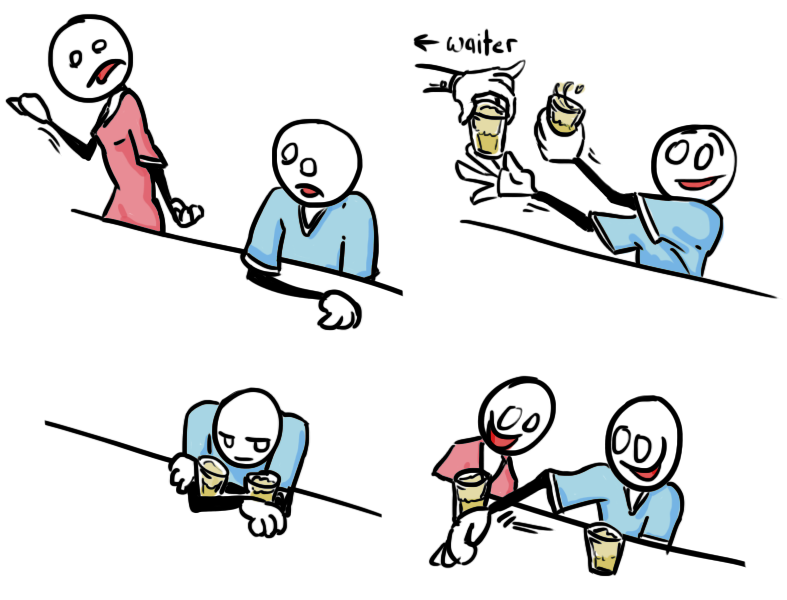
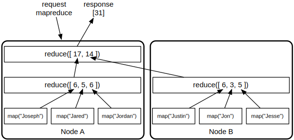

#  开发者

<aside class="sidebar"><h3>关于“节点”</h3>

值得一提的是，我使用“节点”这个词很多。实际上，这意味着一个物理/虚拟服务器，但真正的Riak工作母机是“v节点(vnode)”。

当你写入多个v节点(vnode)时，Riak将尝试将值传播到尽可能多的物理服务器。 但是，这不能保证（例如，如果你只有2台物理服务器的默认`n_val`为3，某些数据将被复制到同一服务器两次）。你将节点概念化为Riak实例是安全的，它在所有时候都比符合“v节点(vnode)”要简单。如果某些东西适用于v节点(vnode)，我会提及它
</aside>

_眼下我们打算暂缓安装Riak的细节部分。如果你想自己一个人开始，可以通过遵循网站 (http://docs.basho.com) 上的  [install documentation](http://docs.basho.com/riak/latest/) 轻松的开始. 不然的话，这会是一个很棒的阅读部分当你坐在没有网络的火车上时。_

一旦了解了一些更细微的点，用Riak数据库进行开发是非常容易的。在技术意义上，它是一个键/值存储（您将值与键相关联，并使用相同的键检索它们），但它为用户提供了更多。您可以在写入之前或之后嵌入写入钩子，或者用于快速检索的索引数据。Riak具有SOLR搜索功能，可让您运行MapReduce函数，以便在相对较短的时间范围内跨巨大的集群提取和聚合数据。 我们将显示一些可配置的具体的储存桶设置。

## 查找 Lookup

<aside class="sidebar"><h3>支持的语言 Supported Languages</h3>

Ruby.Riak 2.0具有以下语言的官方驱动程序:
Erlang, Java, Python, Ruby.

包括社区提供的驱动程序，支持的语言甚至更多: C/C++, PHP, Clojure, Common Lisp, Dart, Go, Groovy, Haskell, JavaScript (jQuery and NodeJS), Lisp Flavored Erlang, .NET, Perl, PHP, Play, Racket, Scala, Smalltalk.

在  [Basho docs](http://docs.basho.com/riak/latest/)  中可以找到数十个其他项目特定的插件。
</aside>

由于Riak是KV数据库，因此最基本的命令是设置和获取值。我们将使用HTTP接口，通过curl，但我们可以很容易地使用Erlang，Ruby，Java或任何其他支持的语言。

Riak请求的基本结构是设置一个值，读取它，
也可能最终删除它。这些操作与HTTP方法有关
 (PUT, GET, POST, DELETE).

```bash
PUT    /types/<type>/buckets/<bucket>/keys/<key>
GET    /types/<type>/buckets/<bucket>/keys/<key>
DELETE /types/<type>/buckets/<bucket>/keys/<key>
```

对于本章的例子，我们来调用一个指向我们访问节点的URL的环境变量`$RIAK`。

```bash
export RIAK=http://localhost:8098
```

<h4>PUT</h4>

Riak中最简单的写入命令是放置一个值。它需要一个键，值和一个存储桶。在curl中，所有HTTP方法都以`-X`为前缀。把一个`pizza`的值放入在`food`储存桶下的`favorite` 键中，这个项目的`items`储存桶类型如下:

```bash
curl -XPUT "$RIAK/types/items/buckets/food/keys/favorite" \
  -H "Content-Type:text/plain" \
  -d "pizza"
```

我在里面出了一些难题。`-d`标志表示下一个字符串将会是该值。我们用字符串`pizza`保持简单，用文本`-H 'Content-Type:text/plain'`声明为文本。这将此值的HTTP MIME类型定义为纯文本。我们可以设置任何值，无论是XML还是JSON ---即使是图像或视频。只要对象大小不超过4MB（软限制，超出限制是不明智的），Riak就不关心所上传的数据。

<h4>GET</h4>

下一个命令在`items`/`food`/`favorite`下读取值`pizza`.

```bash
curl -XGET "$RIAK/types/items/buckets/food/keys/favorite"
pizza
```

这是最简单的读取形式，仅响应值。Riak包含了更多信息，如果你读取整个响应（包括HTTP标头），你可以访问它们。

在`curl`中，您可以通过`-i`标记访问完整的响应。我们再次执行上面的查询，添加该标志（`-XGET`是默认的curl方法，所以我们可以把它关掉）。

```bash
curl -i "$RIAK/types/items/buckets/food/keys/favorite"
HTTP/1.1 200 OK
X-Riak-Vclock: a85hYGBgzGDKBVIcypz/fgaUHjmdwZTImMfKcN3h1Um+LAA=
Vary: Accept-Encoding
Server: MochiWeb/1.1 WebMachine/1.9.0 (someone had painted...
Last-Modified: Wed, 10 Oct 2012 18:56:23 GMT
ETag: "1yHn7L0XMEoMVXRGp4gOom"
Date: Thu, 11 Oct 2012 23:57:29 GMT
Content-Type: text/plain
Content-Length: 5

pizza
```

虽然HTTP的解剖结构有点超出这本小书的内容，但是我们还是可以来看几个值得注意的部分。

<h5>状态码 Status Codes</h5>

第一行给出HTTP版本1.1响应代码`200 OK`。 你可能熟悉常见的网站代码`404 Not Found`。有多种[HTTP 状态码](http://www.w3.org/Protocols/rfc2616/rfc2616-sec10.html)，Riak HTTP接口会对其目标保持true: **1xx Informational**, **2xx Success**, **3xx Further Action**, **4xx Client Error**, **5xx Server Error**

不同的操作可以返回不同的响应/错误代码。 完整的列表可以在[官方API文档](http://docs.basho.com/riak/latest/references/apis/)中找到。

<h5>校时 Timings</h5>

一组标题表示对象或请求的不同时序。

* **最后更改Last-Modified** - 最后一次修改此对象（创建或更新）。
* **被请求变量的实体值ETag** - 可用于客户端高速缓存验证的*[实体标签](http://en.wikipedia.org/wiki/HTTP_ETag)* 。
* **日期Date** - 请求的时间。
* **X-Riak-Vclock** - 一个逻辑时钟，我们将在后面详细介绍。

<h5>内容 Content</h5>

这些描述消息的HTTP主体（以Riak的术语，值）。

* **内容类型Content-Type** - 值的类型, 比如 `text/xml`.
* **内容长度Content-Length** - 消息体的长度（以字节为单位）。

其他一些标题如 `Link` 将在本章后面介绍。


<h4>POST</h4>

与PUT类似，POST将保存一个值。但是用POST键是可选的。它需要的是一个桶名称（并且应该包括一个类型），它将为你生成一个键。

我们添加一个JSON值来表示一个人在`json`/`people` type/bucket下。 响应头是POST返回为你生成的键的位置。

```bash
curl -i -XPOST "$RIAK/types/json/buckets/people/keys" \
  -H "Content-Type:application/json" \
  -d '{"name":"aaron"}'
HTTP/1.1 201 Created
Vary: Accept-Encoding
Server: MochiWeb/1.1 WebMachine/1.9.2 (someone had painted...
Location: /riak/people/DNQGJY0KtcHMirkidasA066yj5V
Date: Wed, 10 Oct 2012 17:55:22 GMT
Content-Type: application/json
Content-Length: 0
```

你可以从 `Location` 值提取此键。除了不是很好之外，这个键被视为与通过PUT定义自己的键一样。

<h5>主体Body</h5>

你可能会注意到没有主体被响应返回。对于任何类型的写入，你可以添加`returnbody=true`参数来强制返回值，以及与`X-Riak-Vclock`和`ETag`等值相关的头。

```bash
curl -i -XPOST "$RIAK/types/json/buckets/people/keys?returnbody=true" \
  -H "Content-Type:application/json" \
  -d '{"name":"billy"}'
HTTP/1.1 201 Created
X-Riak-Vclock: a85hYGBgzGDKBVIcypz/fgaUHjmdwZTImMfKkD3z10m+LAA=
Vary: Accept-Encoding
Server: MochiWeb/1.1 WebMachine/1.9.0 (someone had painted...
Location: /riak/people/DnetI8GHiBK2yBFOEcj1EhHprss
Last-Modified: Tue, 23 Oct 2012 04:30:35 GMT
ETag: "7DsE7SEqAtY12d8T1HMkWZ"
Date: Tue, 23 Oct 2012 04:30:35 GMT
Content-Type: application/json
Content-Length: 16

{"name":"billy"}
```

这对于PUT和POST是正确的。

<h4>删除DELETE</h4>

最后的基本操作是删除键，类似于获取值，但将DELETE方法发送到 `type`/`bucket`/`key`。

```bash
curl -XDELETE "$RIAK/types/json/buckets/people/keys/DNQGJY0KtcHMirkidasA066yj5V"
```

通过编写一个标记为墓碑的标记，将Riak中的一个已删除的对象内部标记为已删除。 除非另有配置，否则称为收割者（reaper）的另一过程将在以后完成删除标记对象。

这个细节通常不是重要的，除了理解两件事情：

1. 在Riak中，*删除*实际上是一个*读取*和*写入*，并且在计算读/写比率时应该被认为是这样。
2. 检查键的存在还不足以知道对象是否存在。删除后可能会读取键，因此您应该检查墓碑元数据。

<h4>列表Lists</h4>

Riak提供了两种列表。 第一个列出了群集中的所有*桶*，而第二个列出了特定桶下的所有*键*。这两个行动都是以同样的方式召唤的，有两种变化。

以下将给我们所有的桶作为JSON对象。

```bash
curl "$RIAK/types/default/buckets?buckets=true"

{"buckets":["food"]}
```

这将给我们在`food`桶下的所有键。

```bash
curl "$RIAK/types/default/buckets/food/keys?keys=true"
{
  ...
  "keys": [
    "favorite"
  ]
}
```

如果我们有很多键，这显然可能需要一段时间。 因此，Riak还提供了流式传输键。`keys=stream`的功能，可以保持连接的打开状态，并以数组的形式返回结果。 当它已经用完列表时，它将关闭连接。 你可以通过curl在verbose（-v）mode下来查看详细信息（其中的大部分内容已被删除）。

```bash
curl -v "$RIAK/types/default/buckets/food/keys?keys=stream"
...

* Connection #0 to host localhost left intact
...
{"keys":["favorite"]}
{"keys":[]}
* Closing connection #0
```

<!-- Transfer-Encoding -->

你应该注意，列表操作不应该在作业中使用（它们确实是费力的操作）。但它们对于开发，调查或在非高峰时段进行偶尔的分析是有用的。

## 有条件的请求 Conditional requests

可以使用Riak的条件请求，但是由于其可用性/最终一致性模型的性质，这些条件是脆弱的。

### GET

通过HTTP从Riak检索值时，会包含最后修改的时间戳和[ETag](https://en.wikipedia.org/wiki/HTTP_ETag)。 这些可能用于将来的 `GET` 请求; 如果值未更改，将返回304未更改状态。

例如，假设你收到以下标题。

```bash
Last-Modified: Thu, 17 Jul 2014 21:01:16 GMT
ETag: "3VhRP0vnXbk5NjZllr0dDE"
```

请注意，引号是ETag的一部分。

如果ETag通过下一个请求中的`If-None-Match`头部使用：

```bash
curl -i "$RIAK/types/default/buckets/food/keys/dinner" \
  -H 'If-None-Match: "3VhRP0vnXbk5NjZllr0dDE"'
HTTP/1.1 304 Not Modified
Vary: Accept-Encoding
Server: MochiWeb/1.1 WebMachine/1.10.5 (jokes are better explained)
ETag: "3VhRP0vnXbk5NjZllr0dDE"
Date: Mon, 28 Jul 2014 19:48:13 GMT
```

类似地，最后修改的时间戳可以与`If-Modified-Since`一起使用：

```bash
curl -i "$RIAK/types/default/buckets/food/keys/dinner" \
  -H 'If-Modified-Since: Thu, 17 Jul 2014 21:01:16 GMT'
HTTP/1.1 304 Not Modified
Vary: Accept-Encoding
Server: MochiWeb/1.1 WebMachine/1.10.5 (jokes are better explained)
ETag: "3VhRP0vnXbk5NjZllr0dDE"
Date: Mon, 28 Jul 2014 19:51:39 GMT
```

### 放&删除 PUT & DELETE

当添加，更新或删除内容时，HTTP头如果`If-None-Match`, `If-Match`, `If-Modified-Since`, and
`If-Unmodified-Since`可以用于指定ETag和时间戳。

如果无法满足指定的条件，则会导致`412 Precondition Failed`状态。

## 桶类型/桶 Bucket Types/Buckets

尽管目前我们一直在使用桶类型和桶作为命名空间，但是它们有更多的功能。

不同的用例将决定桶是大量写入还是大部分读取。 您可以使用一个桶来存储日志，一个桶可以存储会话数据，而另一个可以存储购物车数据。 有时低延迟是重要的，而其他时候它的耐用性很高。 有时我们只是希望在发生写操作时，桶会产生不同的反应。

<h3>法定人数 Quorum</h3>

Riak的可用性和宽容性的基础是它可以读取或写入多个节点。 Riak允许您在每个桶的基础上调整这些N / R / W值（我们在概念下涵盖）。

<h4>N/R/W</h4>

N是要复制值的总节点数，默认为3.但是我们可以将此`n_val`设置为小于总节点数。

任何桶属性（包括`n_val`）可以通过将一个 `props` 值作为JSON对象发送到桶URL来设置。 让我们将`n_val`设置为5个节点，这意味着写入`cart`的对象将被复制到5个节点。

```bash
curl -i -XPUT "$RIAK/types/default/buckets/cart/props" \
  -H "Content-Type: application/json" \
  -d '{"props":{"n_val":5}}'
```

你可以通过向桶中发出GET来窥探桶的属性。

*注意：Riak返回未格式化的JSON。 如果你安装了jsonpp（或json_pp）等命令行工具，则可以将通过管道的输出更容易阅读。 以下结果是所有`props`值的一个子集。*

```bash
curl "$RIAK/types/default/buckets/cart/props" | jsonpp
{
  "props": {
    ...
    "dw": "quorum",
    "n_val": 5,
    "name": "cart",
    "postcommit": [],
    "pr": 0,
    "precommit": [],
    "pw": 0,
    "r": "quorum",
    "rw": "quorum",
    "w": "quorum",
    ...
  }
}
```

你可以看到，`n_val`是5.这是可以预料的。 但是你也可能已经注意到，`props`将`r`和`w`两个作为`quorum`，而不是一个数字。 那么什么是*法定人数*？

<h5>符号价值 Symbolic Values</h5>

*法定人数*是所有总复制节点的一半以上（`floor（N / 2）+ 1`）。 这个数字很重要，因为如果超过一半的节点被写入，并且超过一半的节点被读取，那么你将获得最新的值（在正常情况下）。

这里有一个例子，上面的`n_val`为5（{A，B，C，D，E}）。 你的`w`是一个法定人数（这是`3`，或`floor(5/2)+1`），所以在写入{A，B，C}（{D，E} 最终被复制到）。 紧接着，读取法定人数可以从{C，D，E}获取值。 即使D和E具有较旧的值，您也从节点C中提取了一个值，这意味着您将收到最近的值。

重要的是你的读写重叠。 只要`r+w > n`，在没有草率的法定人数（下）的情况下，您将能够获得最新的值。 换句话说，你将有一个合理的一致性。

法定人数`quorum`是一个很好的默认值，因为你从平衡的节点读写。 但是，如果你有特定要求，例如通常写入但很少读取的日志，则可能会发现从单个节点等待成功写入更有意义，但从所有这些读取。 这会给你一个重叠

```bash
curl -i -XPUT "$RIAK/types/default/buckets/logs/props" \
  -H "Content-Type: application/json" \
  -d '{"props":{"w":"one","r":"all"}}'
```

* `all` - All replicas must reply, which is the same as setting `r` or `w` equal to `n_val`
* `one` - Setting `r` or `w` equal to `1`
* `quorum` - A majority of the replicas must respond, that is, “half plus one”.

<h4>草率的法定人数Sloppy Quorum</h4>

理想的状况是严格的法定人数对于大部分的写入请求都是足够的。然而，在任何时刻，一个节点可能会下降，或者网络可能分区，或松鼠被捕获在管中，从而触发不可用的所需节点。 这被称为严格的法定人数。 Riak默认为所谓的草率的法定人数，这意味着如果任何主（预期）节点不可用，则环中的下一个可用节点将接受请求。

想像这样。比如你和你的朋友一起喝酒 您订购2杯饮料（W = 2），但在到达之前，她暂时离开。如果你是一个严格的法定人数，你只能拒绝这两种饮料，因为所需的人（N = 2）不可用。但是你宁愿喝醉了，呃，我的意思是草率的法定人数。不要拒绝喝酒，而是取两个，一个被接受（你也得付钱）。



当她回来的时候，你把她的饮料倒过来。 这被称为暗示切换，我们将在下一章再次讨论。 现在，足够的是，默认的草率的法定人数（W）之间存在差异，并且需要主节点（PW）的严格法定人数。

<h5>超过R和W More than R's and W's</h5>

你在桶的`props`对象中可能注意到的其他一些值是`pw`,`pr`,和`dw`。

`pr`和`pw`确保在读取或写入之前有许多主节点可用。 由于网络分区或某些其他服务器中断，Riak将从备份节点读取或写入数据。 该p前缀将确保仅使用主节点，主要意味着与桶加N连接的v节点匹配的v节点。

(我们上面提到，`r+w > n`提供了一个合理的一致性，在涉及到草率的法定人数时被违反.`pr+pw > n`允许更坚定的一致性断言，尽管总是存在涉及写入冲突或重大磁盘故障的场景 那也可能还不够)

最后，`dw`表示成功所需的最小持久写入。 对于正常的`w`写入来计算写入成功，v节点只需要承诺写入已经开始，不能保证写入已经写入磁盘，也是耐用的。 `dw`设置意味着后端服务（例如Bitcask）已同意写入该值。 虽然高`dw`值低于高`w`值，但有些情况下，这种额外的执行情况很好，例如处理财务数据。

<h5>每个请求 Per Request</h5>

值得注意的是，每个请求可以覆盖这些值（`n_val`除外）。

考虑一个你搜寻非常重要的数据（例如信用卡结帐）的场景，并希望确保在成功之前将其写入每个相关节点的磁盘。 你可以添加`?dw=all`到你的写作结尾。

```bash
curl -i -XPUT "$RIAK/types/default/buckets/cart/keys/cart1?dw=all" \
  -H "Content-Type: application/json" \
  -d '{"paid":true}'
```

如果当前负责数据的任何节点无法完成请求（即将数据切换到存储后端），则客户端将收到故障消息。 这并不意味着写入失败，必然：如果三个主要v节点中的两个成功写入了该值，那么它应该可用于将来的请求。 因此，通过强制一个高`dw`或`pw`值可以获得一致性可能会导致意外的行为。

<h3>钩 Hooks</h3>

桶的另一个实用程序是他们通过钩来执行写入行为的能力。 您可以附加函数以在值提交到桶的之前或之后运行。

预先钩是在调用写入之前运行的函数。如果输入的数据在某些方面被认为是坏的，则预先钩具有完全取消写入的能力。一个简单的预先钩是检查一个值是否存在。

我把我的自定义Erlang代码文件在riak中安装到 `./custom/my_validators.erl`下。

```java
-module(my_validators).
-export([value_exists/1]).

%% Object size must be greater than 0 bytes
value_exists(RiakObject) ->
  Value = riak_object:get_value(RiakObject),
  case erlang:byte_size(Value) of
    0 -> {fail, "A value sized greater than 0 is required"};
    _ -> RiakObject
  end.
```

然后编译文件。

```bash
erlc my_validators.erl
```

通过向Riak安装新的代码安装文件，并在每个节点中的`riak.conf`旁边安装`advanced.config`文件，然后重新启动每个节点。

```bash
{riak_kv,
  {add_paths, ["./custom"]}
}
```

那么你需要设置Erlang模块(`my_validators`)和函数 (`value_exists`) 作为一个JSON值给桶的预占数组`{"mod":"my_validators","fun":"value_exists"}`。

```bash
curl -i -XPUT "$RIAK/types/default/buckets/cart/props" \
  -H "Content-Type:application/json" \
  -d '{"props":{"precommit":[{"mod":"my_validators","fun":"value_exists"}]}}'
```

如果你尝试并将其发布到 `cart` 桶中，而无需值，则应该会发生故障。

```bash
curl -XPOST "$RIAK/types/default/buckets/cart/keys" \
  -H "Content-Type:application/json"
A value sized greater than 0 is required
```

你还可以在JavaScript中编写预提交函数，通过Erlang代码将执行得更快。

后提交在形式和功能上是相似的，只不过是在执行写入之后执行。主要差异：

* 唯一支持的语言是Erlang。
* 函数的返回值被忽略，因此不能将失败消息发送到客户端。


## 数据类型 Datatypes

Riak 2.0中的一个新功能是数据类型。 而不是过去的不透明值，这些新添加允许用户定义在给定桶类型下接受的值的类型。 除了上一章自动解决冲突中列出的好处之外，你还可以以不同的方式与数据类型进行交互。

<aside id="crdt" class="sidebar"><h3>CRDT</h3>

在上一章中，我说Riak数据类型被实现为CRDT。 给出的CRDT的定义是无冲突的复制数据类型。 这只是部分正确。 实际上，CRDT有两种变体，即描述如何保持复制的数据类型无冲突。 它们是Convergent（CvRDT）和Commutative（CmRDT）。

CmRDT是用交换操作更新的数据类型。 CvRDT确保不同的状态收敛到单个值。 这个区别在Riak中很有趣，因为Basho实际上是两者兼而有之。 您可以通过交换操作与数据类型进行交互（意味着首先发生的事情无关紧要），而任何潜在的分歧状态最终都会收敛。
</aside>

在正常的Riak操作中，如我们所见，您将带有给定键的值放入类型/桶对象中。 如果要存储图，比如说，作为代表一个人的JSON对象，你可以把整个对象的每个字段/值作为一个操作。

```bash
curl -XPOST "$RIAK/types/json/buckets/people/keys/joe" \
  -H "Content-Type:application/json"
  -d '{"name_register":"Joe", "pets_set":["cat"]}'
```

但是，如果你想添加一条`fish`作为宠物，你必须更换整个对象。

```bash
curl -XPOST "$RIAK/types/json/buckets/people/keys/joe" \
  -H "Content-Type:application/json"
  -d '{"name_register":"Joe", "pets_set":["cat", "fish"]}'
```

正如我们在上一章中看到的那样，这样会有冲突的风险，从而创造了一个siblings。

```
{"name_register":"Joe", "pets_set":["cat"]}
{"name_register":"Joe", "pets_set":["cat", "fish"]}
```

但是，如果我们使用图，我们只会发布更新来创建图。 因此，假设桶类型`map`是图数据类型（我们将在下一章中看到操作员可以如何将数据类型分配给桶类型）。 该命令将插入一个具有两个字段(`name_register` 和 `pets_set`)的图对象。

```bash
curl -XPOST "$RIAK/types/map/buckets/people/keys/joe" \
  -H "Content-Type:application/json"
  -d '{
    "update": {
      "name_register": "Joe"
      "pets_set": {
        "add_all": "cat"
      }
    }
  }'
```

接下来，我们要更新`joe`地图中包含的`pets_set`。而不是设置joe的名字和他的宠物猫，我们只需要通知对象的变化。也就是说，我们想给他的`pets_set`添加一条`fish`。

```bash
curl -XPOST "$RIAK/types/map/buckets/people/keys/joe" \
  -H "Content-Type:application/json"
  -d '{
    "update": {
      "pets_set": {
        "add": "fish"
      }
    }
  }'
```

这有一些好处。 首先，我们不需要发送重复的数据。 其次，两个请求发生的顺序并不重要，结果将是一样的。 第三，由于操作是CmRDTs，所以没有数据类型返回siblings的可能性，使您的客户端代码更容易。

如前所述，有四个Riak数据类型：*map*, *set*, *counter*, *flag*。 对象类型设置为桶类型属性。 但是，如我们所见，填充地图时，您必须使用要存储的数据类型对字段名称进行后缀：\*\_map, \*\_set, \*\_counter, \*\_flag。 对于纯字符串值，有一个特殊的\*\_注册数据类型后缀。

您可以在[datatypes in the docs](http://docs.basho.com/riak/latest/dev/using/data-types)阅读更多信息。


## 熵 Entropy

熵是最终一致性的副产品。 换句话说：尽管最终的一致性表示写入将及时复制到其他节点，但是在所有节点不包含相同值的情况下可能会有一点延迟。

这个差异是*熵*，因此Riak已经创建了几个*反熵*策略（缩写为*AE*）。 当写入/读取请求与至少一个节点重叠时，我们已经讨论了R/W仲裁如何处理不同的值。 Riak可以修复熵，或者允许你自己选择这样做。

Riak有两个基本的策略来解决冲突的写入。

<h3>最后一次写入胜利 Last Write Wins</h3>

最基本的，最不可靠的解决熵的策略称为*最后一次写入胜利*。 这是一个简单的想法，基于节点的系统时钟的最后一个写入将覆盖旧的。 这是Riak中的默认行为（由于`allow_mult`属性默认为`false`）。 您也可以将`last_write_wins`属性设置为`true`，通过永久保留向量时钟历史来提高性能。

实际上，当你真的不在乎真正的操作顺序，或丢失数据的可能性时，这是为了提高速度和简单性。 由于不可能保持服务器时钟真正的同步（没有众所周知的与地质同步的原子钟），这是一个最好的猜测，关于“最后”是什么意思，关于最近的毫秒。

<h3>Vector Clocks</h3>

As we saw under [Concepts](#practical-tradeoffs), *vector clocks* are Riak's way of tracking a true sequence of events of an object. Let's take a look at using vector clocks to allow for a more sophisticated conflict resolution approach than simply retaining the last-written value.

<h4>原型Siblings</h4>

*原型*发生时，你会有冲突值，没有明确的方式让Riak知道哪个值是正确的。 从Riak 2.0开始，只要你使用不是数据类型的自定义（不是“默认”）存储桶类型，冲突的写入应创建原型。 这是一件好事，因为它确保没有数据丢失。

在放弃自定义桶类型的情况下，如果`allow_mult`参数配置为`false`，Riak将尝试解决这些冲突本身。 你通常应该把你的桶设置为保留原型，由客户端解决，确保`allow_mult`是`true`。

```bash
curl -i -XPUT "$RIAK/types/default/buckets/cart/props" \
  -H "Content-Type:application/json" \
  -d '{"props":{"allow_mult":true}}'
```

原型出现在几种情况下。

1. 客户端使用陈旧（或缺失）向量时钟写入一个值。
2. 两个客户端以相同的向量时钟值同时写入。

当我们介绍矢量时钟的概念时，我们使用第二个场景来制造前一章的冲突，我们再次这样做。

<h4>创建示例冲突 Creating an Example Conflict</h4>

想象一下，我们为单个冰箱创建一个购物车，但是家里的几个人能够为其订购食物。 由于丢失订单会导致家庭不愉快，Riak正在使用自定义桶类型“购物”，它保留默认值`allow_mult=true`。

首先 Casey（素食主义者）将10羽羽衣甘蓝放在购物车中。

Casey 写入 `[{"item":"kale","count":10}]`.

```bash
curl -i -XPUT "$RIAK/types/shopping/buckets/fridge/keys/97207?returnbody=true" \
  -H "Content-Type:application/json" \
  -d '[{"item":"kale","count":10}]'
HTTP/1.1 200 OK
X-Riak-Vclock: a85hYGBgzGDKBVIcypz/fgaUHjmTwZTImMfKsMKK7RRfFgA=
Vary: Accept-Encoding
Server: MochiWeb/1.1 WebMachine/1.9.0 (someone had painted...
Last-Modified: Thu, 01 Nov 2012 00:13:28 GMT
ETag: "2IGTrV8g1NXEfkPZ45WfAP"
Date: Thu, 01 Nov 2012 00:13:28 GMT
Content-Type: application/json
Content-Length: 28

[{"item":"kale","count":10}]
```

注意Riak返回的不透明向量时钟（通过`X-Riak-Vclock`标题）。 对于该密钥发出的任何读取请求将返回相同的值，直到发生另一个写入。

他的室友Mark，读了订单，加了牛奶。 为了让Riak正确跟踪更新历史记录，Mark在他的PUT中包含了最近的矢量时钟。

Mark 写入 `[{"item":"kale","count":10},{"item":"milk","count":1}]`.

```bash
curl -i -XPUT "$RIAK/types/shopping/buckets/fridge/keys/97207?returnbody=true" \
  -H "Content-Type:application/json" \
  -H "X-Riak-Vclock:a85hYGBgzGDKBVIcypz/fgaUHjmTwZTImMfKsMKK7RRfFgA="" \
  -d '[{"item":"kale","count":10},{"item":"milk","count":1}]'
HTTP/1.1 200 OK
X-Riak-Vclock: a85hYGBgzGDKBVIcypz/fgaUHjmTwZTIlMfKcMaK7RRfFgA=
Vary: Accept-Encoding
Server: MochiWeb/1.1 WebMachine/1.9.0 (someone had painted...
Last-Modified: Thu, 01 Nov 2012 00:14:04 GMT
ETag: "62NRijQH3mRYPRybFneZaY"
Date: Thu, 01 Nov 2012 00:14:04 GMT
Content-Type: application/json
Content-Length: 54

[{"item":"kale","count":10},{"item":"milk","count":1}]
```

如果仔细观察，您会发现矢量时钟随着第二个写请求而改变

* a85hYGBgzGDKBVIcypz/fgaUHjmTwZTI<strong>mMfKsMK</strong>K7RRfFgA= (after the write by Casey)
* a85hYGBgzGDKBVIcypz/fgaUHjmTwZTI<strong>lMfKcMa</strong>K7RRfFgA= (after the write by Mark)

现在让我们考虑一个第三个室友，Andy，喜欢杏仁。 在Mark用牛奶更新共享车之前，Andy检索了Casey的羽衣甘蓝命令并附加了杏仁。 与马克一样，安迪的更新包括在凯西的原始写作之后存在的向量时钟。

Andy 写入 `[{"item":"kale","count":10},{"item":"almonds","count":12}]`.

```bash
curl -i -XPUT "$RIAK/types/shopping/buckets/fridge/keys/97207?returnbody=true" \
  -H "Content-Type:application/json" \
  -H "X-Riak-Vclock:a85hYGBgzGDKBVIcypz/fgaUHjmTwZTImMfKsMKK7RRfFgA="" \
  -d '[{"item":"kale","count":10},{"item":"almonds","count":12}]'
HTTP/1.1 300 Multiple Choices
X-Riak-Vclock: a85hYGBgzGDKBVIcypz/fgaUHjmTwZTInMfKoG7LdoovCwA=
Vary: Accept-Encoding
Server: MochiWeb/1.1 WebMachine/1.9.0 (someone had painted...
Last-Modified: Thu, 01 Nov 2012 00:24:07 GMT
ETag: "54Nx22W9M7JUKJnLBrRehj"
Date: Thu, 01 Nov 2012 00:24:07 GMT
Content-Type: multipart/mixed; boundary=Ql3O0enxVdaMF3YlXFOdmO5bvrs
Content-Length: 491


--Ql3O0enxVdaMF3YlXFOdmO5bvrs
Content-Type: application/json
Etag: 62NRijQH3mRYPRybFneZaY
Last-Modified: Thu, 01 Nov 2012 00:14:04 GMT

[{"item":"kale","count":10},{"item":"milk","count":1}]
--Ql3O0enxVdaMF3YlXFOdmO5bvrs
Content-Type: application/json
Etag: 7kfvPXisoVBfC43IiPKYNb
Last-Modified: Thu, 01 Nov 2012 00:24:07 GMT

[{"item":"kale","count":10},{"item":"almonds","count":12}]
--Ql3O0enxVdaMF3YlXFOdmO5bvrs--
```

哇！ 那是什么

由于Mark和Andy设定冰箱值之间存在冲突，Riak保持了两者的值。

<h4>VTag</h4>

由于我们使用HTTP客户端，Riak用`multipart/mixed`MIME类型返回了一个`300 Multiple Choices`代码。 你可以解析结果（或者你可以通过它的Etag请求一个特定值，也称为Vtag）。

发布一个简单的`shopping/fridge/97207`键也将返回所有原型的vtags。

```
curl "$RIAK/types/shopping/buckets/fridge/keys/97207"
Siblings:
62NRijQH3mRYPRybFneZaY
7kfvPXisoVBfC43IiPKYNb
```

你能用这个标签做什么？ 也就是说，你通过它的`vtag`请求一个特定原型的价值。 要获得列表中的第一个原型（Mark的牛奶）：

```bash
curl "$RIAK/types/shopping/buckets/fridge/keys/97207?vtag=62NRijQH3mRYPRybFneZaY"
[{"item":"kale","count":10},{"item":"milk","count":1}]
```

如果要检索所有原型数据，请告诉Riak，你将通过添加`-H "Accept:multipart/mixed"`来接受multipart消息。

```bash
curl "$RIAK/types/shopping/buckets/fridge/keys/97207" \
  -H "Accept:multipart/mixed"
```

<aside class="sidebar"><h3>具体用例？ Use-Case Specific?</h3>

当原型被创建时，由应用程序决定知道如何处理
与冲突。 在我们的例子中，我们只想接受其中的一个
命令？ 我们应该除去牛奶和杏仁，只能保持羽衣甘蓝吗？
我们应该计算两者的便宜，并保持最便宜的选择吗？
我们应该将所有的结果合并成一个单一的顺序吗？ 这就是为什么我们要求
Riak不能自动解决这个冲突...我们想要这种灵活性。
</aside>

<h4>解决冲突 Resolving Conflicts</h4>

当我们有冲突的写入时，我们想解决它们。 由于该问题通常是*用例特定*，Riak将其延伸到我们，我们的应用程序必须决定如何进行。

对于我们的示例，让我们将值合并成一个单一的结果集，如果*类型*相同，则使用较大的*计数*。 完成后，使用多部分对象的vclock将新结果写回Riak，因此Riak知道你正在解决冲突，你将获得一个新的向量时钟。

连续读取将获得单个（合并）结果。

```bash
curl -i -XPUT "$RIAK/types/shopping/buckets/fridge/keys/97207?returnbody=true" \
  -H "Content-Type:application/json" \
  -H "X-Riak-Vclock:a85hYGBgzGDKBVIcypz/fgaUHjmTwZTInMfKoG7LdoovCwA=" \
  -d '[{"item":"kale","count":10},{"item":"milk","count":1},\
      {"item":"almonds","count":12}]'
```

<h3>最后写入胜利对原型Last write wins vs. siblings</h3>

您的数据和业务需求将决定哪种解决方案适合。 你不需要在全局选择一个策略; 相反，可以自由地利用Riak的桶来指定哪些数据使用原型，并且盲目保留写入的最后一个值。

简要介绍下你要设置的两个配置值：

* `allow_mult`默认为`false`，这意味着最后一次写入胜利。
* 将`allow_mult`设置为`true`指示Riak将冲突的写入保留为原型。
* `last_write_wins`默认为`false`，（可能是反直觉的）仍然意味着行为是最后一次写入胜利：`allow_mult`是行为切换的关键参数。
* 将`last_write_wins`设置为true将通过假设先前的向量时钟没有内在值来优化写入。
* 将“allow_mult”和“last_write_wins”设置为“true”不受支持，并将导致未定义的行为。

<h3>读取修复 Read Repair</h3>

当成功读取发生时，但并非所有副本都符合该值，这将触发*读取修复*。 这意味着Riak将使用最新值更新副本。 当没有找到对象（vnode没有副本）或vnode包含较旧的值（旧的表示它是最新的向量时钟的祖先）时，可能会发生这种情况。 与`last_write_wins`或手动解决冲突不同，读取修复（显然是希望通过名称）由读取而不是写入触发。

如果您的节点不同步（例如，如果您增加了一个桶上的`n_val`），则可以通过执行所有该级别的键的读取操作来强制读取修复。 他们可能会第一次返回“未找到”，但后来的读取将拉出最新的值。

<h3>主动反熵 Active Anti-Entropy (AAE)</h3>

尽管通过读取修复获取请求期间解决冲突的数据足以满足大多数需求，但是由于节点失败并被替换，所以永远不会读取的数据最终可能会丢失。

Riak支持主动反熵（AAE），以主动识别和修复不一致的数据。 此功能还有助于在磁盘损坏或管理错误的情况下恢复数据丢失。

通过维护复杂的散列树（“Merkle tree”），可以轻松地比较vnodes之间的数据集，但是如果需要，可以禁用该功能，从而最大程度地减少了此功能的开销。

## 查询 Querying

到目前为止，我们只处理了键值查找。 事实是，键值是跨越一系列用例的非常强大的机制。 然而，有时我们需要通过值查找数据，而不是键。 有时我们需要执行一些计算，聚合或搜索。

<h3>二次索引 Secondary Indexing (2i)</h3>

*二次索引*（2i）是降低成本的数据结构
查找非关键值。 像许多其他数据库一样，Riak有
索引数据的能力。 但是，由于Riak没有真正的认知
它存储的数据（它们只是二进制值），它使用元数据
索引由名称模式定义为整数或二进制值。

如果您的安装配置为使用2i（如下一章所示），
只需用一个标头将值写入Riak就会成为索引，
前提是它的前缀是'X-Riak-Index-`，后缀为`_int`
整数或`_bin`作为字符串。

```bash
curl -i -XPUT $RIAK/types/shopping/buckets/people/keys/casey \
  -H "Content-Type:application/json" \
  -H "X-Riak-Index-age_int:31" \
  -H "X-Riak-Index-fridge_bin:97207" \
  -d '{"work":"rodeo clown"}'
```

查询可以通过两种形式完成：完全匹配和范围。添加更多的人，我们会看到我们得到的东西：`mark`是`32`，和`andy`是`35`，它们共用`97207`。

什么人拥有“97207”？ 这是一个快速查找接收
具有匹配索引值的键。

```bash
curl "$RIAK/types/shopping/buckets/people/index/fridge_bin/97207"
{"keys":["mark","casey","andy"]}
```

使用这些键，这是一个简单的查找来获取主体。

另一个查询选项是包容性的范围匹配。 这找到所有
`32`岁以下的人，通过在`0`和`32`之间进行搜索。

```bash
curl "$RIAK/types/shopping/buckets/people/index/age_int/0/32"
{"keys":["mark","casey"]}
```

就是这样 这是一个2i的基本形式，具有不错的效用。

<h3>映射归约MapReduce</h3>

MapReduce是一种通过分离大量数据来聚合大量数据的方法
处理成两个阶段，映射和缩小，自己执行
各自的部分。 每个对象将执行映射来转换/提取一些值，
那么那些映射的值将被减少为一些聚合结果。
我们能从这个结构中获益什么吗？ 这是基于它更便宜的想法
将算法移动到数据所在的位置，而不是转移大量数据
数据量到单个服务器运行计算。

这种由Google普及的方法可以在各种NoSQL数据库中看到。
在Riak中，您可以在单个节点上执行MapReduce作业
然后传播到其他节点。 结果被映射和缩小，
然后进一步减少到调用节点并返回。



假设我们有一个存储消息的日志值桶
以INFO或ERROR为前缀。 我们要计算包含单词“cart”的日志的INFO原型的数量。

```bash
LOGS=$RIAK/types/default/buckets/logs/keys
curl -XPOST $LOGS -d "INFO: New user added"
curl -XPOST $LOGS -d "INFO: Kale added to shopping cart"
curl -XPOST $LOGS -d "INFO: Milk added to shopping cart"
curl -XPOST $LOGS -d "ERROR: shopping cart cancelled"
```

MapReduce作业可以是Erlang或JavaScript代码。 这一次我们会去的
容易的路由和写JavaScript。 您可以通过发布JSON来执行MapReduce
`/ mapred`路径。

```bash
curl -XPOST "$RIAK/mapred" \
  -H "Content-Type: application/json" \
  -d @- \
<<EOF
{
  "inputs":"logs",
  "query":[{
    "map":{
      "language":"javascript",
      "source":"function(riakObject, keydata, arg) {
        var m = riakObject.values[0].data.match(/^INFO.*cart/);
        return [(m ? m.length : 0 )];
      }"
    },
    "reduce":{
      "language":"javascript",
      "source":"function(values, arg){
        return [values.reduce(
          function(total, v){ return total + v; }, 0)
        ];
      }"
    }
  }]
}
EOF
```

结果应该是`[2]`，如预期的那样。 图和缩减阶段都应该
总是返回一个数组。 图阶段接收一个单独的riak对象
缩减阶段接收到一个值的数组，无论是多个结果
图功能输出或多个减少输出。 我可能被骗了而
通过使用JavaScript的“reduce”函数来计算值，但是，
欢迎来到MapReduce的思维世界！

<h4>MR + 2i</h4>

使用MapReduce时的另一个选择是将其与次要索引组合在一起。
您可以将2i查询的结果管道传输到MapReducer中，只需指定
索引，以及用于索引查找的`key`或
对于远程查询的`end`值和`start`值。

```json
    ...
    "inputs":{
       "bucket":"people",
       "index": "age_int",
       "start": 18,
       "end":   32
    },
    ...
```

在Riak中的MapReduce是拉出数据的强大方式对于间接键/值存储。
但是我们还有一种寻找方法Riak中的数据。

<aside class="sidebar"><h3>无论发生什么Riak搜索1.x？ Whatever Happened to Riak Search 1.x?</h3>

如果您以前使用过Riak，或者有一些较旧的文档，
您可能会想知道Riak Search 1.0和2.0之间有什么区别。

为了对Riak Search用户友好，最初开发的是
具有“Solr like”的界面。 但可悲的是，由于构建
分布式搜索引擎的复杂性，这是非常不完整的。 Basho决定，
与其试图与Solr保持平等，倒不如一个受欢迎和有特色的
搜索引擎本身就是整合两者的意义更大。
</aside>

<h3>Search 2.0</h3>

Search 2.0是一个完整的，从零开始的在Riak的重新分配搜索。
它是Riak的扩展，可让您执行搜索查找Riak群集中的值。
不像原来的Riak Search，Search 2.0
利用分布式Solr执行倒排索引和管理检索匹配值。

在使用Search 2.0之前，您必须安装它并设置一个桶
使用索引（这些细节可以在下一章中找到）。

最简单的例子是全文搜索。 在这里我们添加`ryan`到
`people`表（带有默认索引）。

```bash
curl -XPUT "$RIAK/type/default/buckets/people/keys/ryan" \
  -H "Content-Type:text/plain" \
  -d "Ryan Zezeski"
```

要执行搜索，请与任何分布式请求`/ solr / <index> / select`
[Solr 参数]（http://wiki.apache.org/solr/CommonQueryParameters）。 在这里，我们
查询包含以“zez”开头的单词的文档，
请求结果是以json格式（`wt = json`），只返回Riak键（`fl = _yz_rk`）。

```bash
curl "$RIAK/solr/people/select?wt=json&omitHeader=true&fl=_yz_rk&q=zez*"
{
  "response": {
    "numFound": 1,
    "start": 0,
    "maxScore": 1.0,
    "docs": [
      {
        "_yz_rk": "ryan"
      }
    ]
  }
}
```

使用匹配的`_yz_rk`键，您可以使用简单的Riak查找检索文本。

Search 2.0支持Solr 4.0，其中包括过滤器查询，范围，页面分数，
起始值和行（最后两个对分页有用）。 您还可以接收匹配的[高亮文本]（http://wiki.apache.org/solr/HighlightingParameters）（`hl`，`hl.fl`），
这对构建搜索引擎非常有用（而且有用于 [search.basho.com]（http://search.basho.com））。
您可以使用分布式Solr执行搜索，统计，地理定位，边界形状或任何其他搜索。

<h4>标记 Tagging</h4>

搜索2.0的另一个有用的功能是标记值。
标记值为Riak值提供附加上下文。
当前的实现需要所有标记的值都以`X-Riak-Meta`开头，
并列在名为`X-Riak-Meta-yz-tags`的特殊标题下。

```bash
curl -XPUT "$RIAK/types/default/buckets/people/keys/dave" \
  -H "Content-Type:text/plain" \
  -H "X-Riak-Meta-yz-tags: X-Riak-Meta-nickname_s" \
  -H "X-Riak-Meta-nickname_s:dizzy" \
  -d "Dave Smith"
```

要通过`nickname_s`标记进行搜索，只需要在查询字符串前加一个冒号即可。

```bash
curl "$RIAK/solr/people/select?wt=json&omitHeader=true&q=nickname_s:dizzy"
{
  "response": {
    "numFound": 1,
    "start": 0,
    "maxScore": 1.4054651,
    "docs": [
      {
        "nickname_s": "dizzy",
        "id": "dave_25",
        "_yz_ed": "20121102T215100 dave m7psMIomLMu/+dtWx51Kluvvrb8=",
        "_yz_fpn": "23",
        "_yz_node": "dev1@127.0.0.1",
        "_yz_pn": "25",
        "_yz_rk": "dave",
        "_version_": 1417562617478643712
      }
    ]
  }
}
```

请注意，返回的`docs`还包含`"nickname_s":"dizzy"`作为值。 所有标记的值将在匹配结果中返回。

<h4>数据类型 Datatypes</h4>

Riak 2.0中更强大的组合之一是数据类型和搜索。
如果您将数据类型和搜索索引都设置在一个存储桶类型的属性中，
那么您设置的值将按照您的预期进行索引。
映射字段被索引为其给定类型，集合是多字段字符串，
计数器作为整数索引，并且标志是布尔值。
嵌套图也被索引，以点分隔，并以这种方式可查询。

例如，还记的来自数据类型部分的Joe么？
我们假设这个`people`桶被编入索引。
我们还添加另一只宠物。

```bash
curl -XPUT "$RIAK/types/map/buckets/people/keys/joe" \
  -H "Content-Type:application/json"
  -d '{"update": {"pets_set": {"add":"dog"}}}'
```

然后让我们搜索`pets_set：dog`，只过滤`type / bucket / key`。

```bash
{
  "response": {
    "numFound": 1,
    "start": 0,
    "maxScore": 1.0,
    "docs": [
      {
        "_yz_rt": "map"
        "_yz_rb": "people"
        "_yz_rk": "joe"
      }
    ]
  }
}
```

Bravo 你现在找到了你想要的对象。
感谢Solr的可定制模式，
如果保存第二个查找非常重要，
你甚至可以存储要返回的字段。

这里提供了两个世界最好的。
您可以更新和查询值，而不用担心发生冲突，
并可以根据字段值查询Riak。
不需要太多的想象力，
看到这种组合有效地将Riak转变为可扩展，
稳定，高可用性的文档数据存储。
将强大的一致性投入到组合中（我们将在下一章中做），
您可以以任何方式存储和查询Riak中的任何内容。

如果你想知道自己，“Mongodb是怎么提供的，”那么，我没有问过。 你做过 但这是一个很好的问题...

好了，让我们继续。


## 综合报导 Wrap-up

Riak是一个分布式数据存储，具有多个添加功能，
可以改进标准的键值查找，例如指定复制值。
由于Riak中的值是不透明的，
所以这些方法中的许多方法都需要自定义代码来提取值并赋予值，
例如*MapReduce*m或允许头元数据为对象提供添加的描述性维度，
例如*辅助索引* 或*搜索*。

接下来，我们将进一步了解引擎盖，并向您展示如何设置和管理您自己的群集。......
