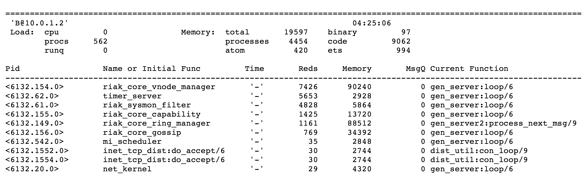
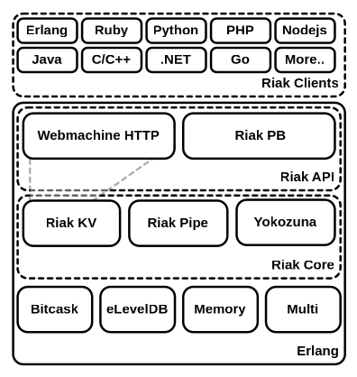
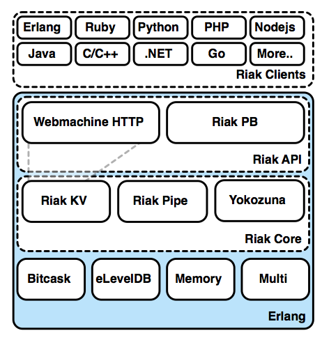
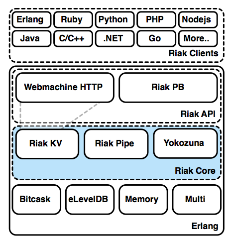
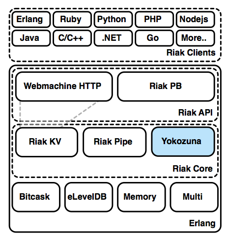
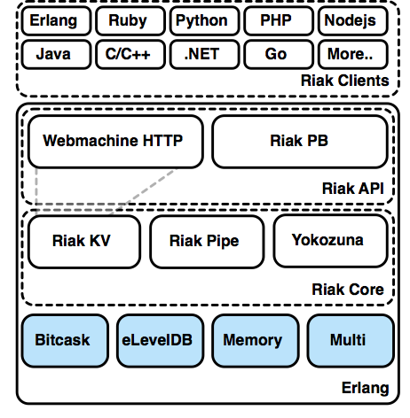
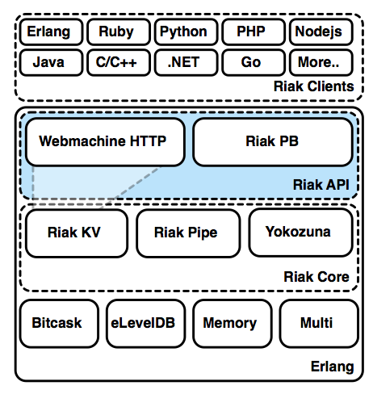
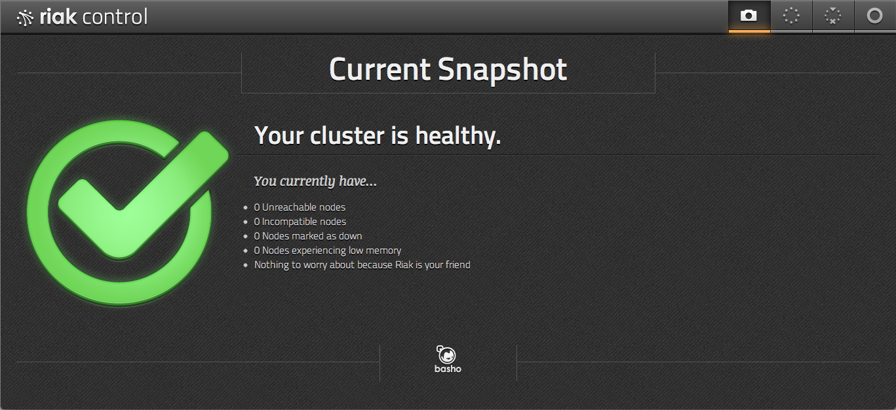
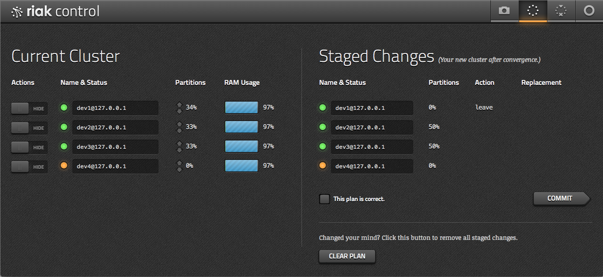
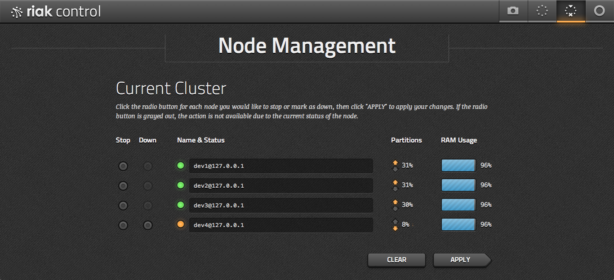

# 运维者 

<!-- What Riak is famous for is its simplicity to operate and stability at increasing scales. -->

在某些方面， Riak作为最易操作的一种NoSQl数据库，它所扮演角色绝对是通俗易懂的。想要更多的服务吗? 添加他们. 一个网络电缆会早晨两点被切断吗？几小时睡觉醒来才回去处理它. 但是处理Riak的可靠性，理解你的应用程序栈的主要部分依然很重要。

我们已经学习了Riak的核心概念，并且我已经提供了一系列如何使用它的说明，但是关于这个数据库的还有更多需要掌握的。如果你计划操作一个你自己的Riak集群，还有一些你需要了解的细节。

## 集群

到目前为止，你已经从概念上了解了有关“集群”和“环”的大概的总结。 我们究竟意图什么，这些细节对 riak 开发者和运营这的实际影响是什么？

在Riak中一个 *集群* 是一个分享普通环的节点的管理集合。

<h3>环</h3>

在Riak中 *环* 实际上是一个双重概念。

Firstly, the Ring represents the consistent hash partitions (the partitions
managed by vnodes). This partition range is treated as circular, from 0 to
2^160-1 back to 0 again. (If you're wondering, yes this means that we are
limited to 2^160 nodes, which is a limit of a 1.46 quindecillion, or
`1.46 x 10^48`, node cluster. For comparison, there are only `1.92 x 10^49`
[silicon atoms on Earth](http://education.jlab.org/qa/mathatom_05.html).)

首先，环表示一致的哈希分区 (分区由 vnodes 管理。此分区范围被视为循环, 从零到2^ 160-1 再回到零。(如果你想知道的话, 这意味着我们的分区
限制为2^ 160 节点, 也是一个被限制为1.46乘以千的16次幂或者
"1.46 x 10 ^48"的节点群集。为了比较, 只有 "1.92 x 10 ^49"。[地球上的硅原子](http://education.jlab.org/qa/mathatom_05.html).)

When we consider replication, the N value defines how many nodes an object is
replicated to. Riak makes a best attempt at spreading that value to as many
nodes as it can, so it copies to the next N adjacent nodes, starting with the
primary partition and counting around the Ring, if it reaches the last
partition, it loops around back to the first one.

当我们考虑复制时, n 值定义了一个对象被复制的节点数。riak 尽其所能尝试将该值传播为尽可能多的节点, 这样它就可以复制到相邻的 n 个节点, 从主分区开始, 并在环上计数, 如果它到达最后一个分区, 它会绕回第一个分区。

Secondly, the Ring is also used as a shorthand for describing the state of the
circular hash ring I just mentioned. This Ring (aka *Ring State*) is a
data structure that gets passed around between nodes, so each knows the state
of the entire cluster. Which node manages which vnodes? If a node gets a
request for an object managed by other nodes, it consults the Ring and forwards
the request to the proper nodes. It's a local copy of a contract that all of
the nodes agree to follow.

其次, 这个环也被用作描述我刚才提到的循环哈希环（hash ring）的状态的简称。这个环 (aka *环状态* ) 是一个数据结构, 通过在节点之间传递, 让每个人都知道整个集群的状态。哪个节点管理哪个 vnodes？如果一个节点获取了由其他节点管理的对象的请求, 那它会咨询该环, 并将请求转发到适当的节点。这是一个所有的节点都同意遵循的合同的本地副本 。

Obviously, this contract needs to stay in sync between all of the nodes. If a node is permanently taken
offline or a new one added, the other nodes need to readjust, balancing the partitions around the cluster,
then updating the Ring with this new structure. This Ring state gets passed between the nodes by means of
a *gossip protocol*.

显然, 此合同需要在所有节点之间保持同步。如果一个节点被永久性地下线或一个新的节点被添加, 其他节点需要重新调整来平衡集群周围的分区, 然后更新这个环的新结构。此环形状态通过 *"gossip协议"* 在节点之间传递。

<h3>Gossip（办公室八卦）和CMD（集群元数据）</h3>

Riak has two methods of keeping nodes current on the state of the Ring. The first, and oldest, is the *gossip protocol*. If a node's state in the cluster is altered, information is propagated to other nodes. Periodically, nodes will also send their status to a random peer for added consistency.

riak有两种方法 使节点的状态保持环的状态。第一个, 最古老的, 是 *gossip协议*。如果群集中的节点状态被改变, 信息将传播到其他节点。周期性地, 节点也将它们的状态发送到随机对等点, 以增加一致性。

A newer method of information exchange in Riak is *cluster metadata* (CMD), which uses a more sophisticated method (plum-tree, DVV consistent state) to pass large amounts of metadata between nodes. The superiority of CMD is one of the benefits of using bucket types in Riak 2.0, discussed below.


Riak中更新的信息交换方法是 *集群元数据（CMD）*，它使用更复杂的方法（plum-tree，数据仓库一致状态）在节点之间传递大量的元数据。 CMD的优势是在Riak 2.0中使用储存桶类型的好处之一，将在下面讨论。

In both cases, propagating changes in Ring is an asynchronous operation, and can take a couple minutes depending on Ring size.

在这两种情况下, 在环中传播变化是一个异步操作, 并且可能需要几分钟的时间，其时间取决于环形大小。

<!-- Transfers will not start while a gossip is in progress. -->

<h3>如何重复使用环</h3>

Even if you are not a programmer, it's worth taking a look at this Ring example. It's also worth
remembering that partitions are managed by vnodes, and in conversation are sometimes interchanged,
though I'll try to be more precise here.

即使你不是一个程序员, 也值得看看这个环的例子。还值得记住的是, 分区是由 vnodes 管理的, 在对话中有时会互换, 但我在这里会尝试更精确。

Let's start with Riak configured to have 8 partitions, which are set via `ring_creation_size`
in the `etc/riak.conf` file (we'll dig deeper into this file later).

让我们从被配置为有八分区的Riak开始, 分区是通过在`etc/riak.conf`文件中的"ring_creation_size"设置的(稍后我们将深入到此文件中)。

```bash
## Number of partitions in the cluster (only valid when first
## creating the cluster). Must be a power of 2, minimum 8 and maximum
## 1024.
##
## Default: 64
##
## Acceptable values:
##   - an integer
ring_size = 8
```

In this example, I have a total of 4 Riak nodes running on `riak@AAA.cluster`,
`riak@BBB.cluster`, `riak@CCC.cluster`, and `riak@DDD.cluster`, each with two partitions (and thus vnodes)

在本例中, 我共有有四个运行在 `riak@AAA.cluster`,`riak@BBB.cluster`, `riak@CCC.cluster`和`riak@DDD.cluster`上的riak节点，并且每个有两个分区 (因而是 vnodes)

Riak has the amazing, and dangerous, `attach` command that attaches an Erlang console to a live Riak
node, with access to all of the Riak modules.

riak 具有惊人的、危险的 "附加" 命令, 它将erlang控制台附加到实时的Riak节点, 并访问所有的Riak模块。  

The `riak_core_ring:chash(Ring)` function extracts the total count of partitions (8), with an array
of numbers representing the start of the partition, some fraction of the 2^160 number, and the node
name that represents a particular Riak server in the cluster.

"riak_core_ring: chash (环)" 函数提取分区的总数 (8), 其中一个数字数组表示分区的开头、2^160个数的一部分以及表示群集中特定riak服务器的节点名称。

```bash
$ bin/riak attach
(riak@AAA.cluster)1> {ok,Ring} = riak_core_ring_manager:get_my_ring().
(riak@AAA.cluster)2> riak_core_ring:chash(Ring).
{8,
 [{0,'riak@AAA.cluster'},
  {182687704666362864775460604089535377456991567872, 'riak@BBB.cluster'},
  {365375409332725729550921208179070754913983135744, 'riak@CCC.cluster'},
  {548063113999088594326381812268606132370974703616, 'riak@DDD.cluster'},
  {730750818665451459101842416358141509827966271488, 'riak@AAA.cluster'},
  {913438523331814323877303020447676887284957839360, 'riak@BBB.cluster'},
  {1096126227998177188652763624537212264741949407232, 'riak@CCC.cluster'},
  {1278813932664540053428224228626747642198940975104, 'riak@DDD.cluster'}]}
```

To discover which partition the bucket/key `food/favorite` object would be stored in, for example,
we execute `riak_core_util:chash_key( {<<"food">>, <<"favorite">>} )` and get a wacky 160 bit Erlang
number we named `DocIdx` (document index).

例如, 为了发现存储桶/钥匙的 "食物/收藏" 对象将被存放在哪个分区, 我们执行 ' riak_core_util: chash_key ({<"food">, < $xmltag$ >}), 并得到一个古怪的160比特的erlang数值, 我们将其命名为 "DocIdx" (文档索引)。

Just to illustrate that Erlang binary value is a real number, the next line makes it a more
readable format, similar to the ring partition numbers.

只是为了说明 erlang 二进制值是实数, 下一行使它成为一种更可读的格式, 类似于环分区号。

```bash
(riak@AAA.cluster)3> DocIdx =
(riak@AAA.cluster)3> riak_core_util:chash_key({<<"food">>,<<"favorite">>}).
<<80,250,1,193,88,87,95,235,103,144,152,2,21,102,201,9,156,102,128,3>>

(riak@AAA.cluster)4> <<I:160/integer>> = DocIdx. I.
462294600869748304160752958594990128818752487427
```

With this `DocIdx` number, we can order the partitions, starting with first number greater than
`DocIdx`. The remaining partitions are in numerical order, until we reach zero, then
we loop around and continue to exhaust the list.

有了"DocIdx"这个数字, 我们可以使分区有序化, 从第一个大于"DocIdx"的数字开始。剩下的分区按数字顺序排列, 直到我们达到零, 然后我们循环遍历直到穷尽list。

```bash
(riak@AAA.cluster)5> Preflist = riak_core_ring:preflist(DocIdx, Ring).
[{548063113999088594326381812268606132370974703616, 'riak@DDD.cluster'},
 {730750818665451459101842416358141509827966271488, 'riak@AAA.cluster'},
 {913438523331814323877303020447676887284957839360, 'riak@BBB.cluster'},
 {1096126227998177188652763624537212264741949407232, 'riak@CCC.cluster'},
 {1278813932664540053428224228626747642198940975104, 'riak@DDD.cluster'},
 {0,'riak@AAA.cluster'},
 {182687704666362864775460604089535377456991567872, 'riak@BBB.cluster'},
 {365375409332725729550921208179070754913983135744, 'riak@CCC.cluster'}]
```

So what does all this have to do with replication? With the above list, we simply replicate a write
down the list N times. If we set N=3, then the `food/favorite` object will be written to
the `riak@DDD.cluster` node's partition `5480631...` (I truncated the number here),
`riak@AAA.cluster` partition `7307508...`, and `riak@BBB.cluster` partition `9134385...`.

那么, 所有这些都与复制有关？在上面的list中, 我们只需复制一个写下的list N次。如果我们设置 N=3, 然后,“食物/喜爱”的对象将被写到“riak@DDD.cluster”点的分区 "5480631" (此处截断了数字), "riak@AAA.cluster"分区"7307508..."和"riak@BBB.cluster"分区 "9134385..."。

If something has happened to one of those nodes, like a network split
(confusingly also called a partition---the "P" in "CAP"), the remaining
active nodes in the list become candidates to hold the data.

如果这些节点之一发生了某些变化，如网络划分（广义上也称为分区 ———“CAP”中的“P”），list中剩余的活动节点将成为保存数据的候选者。

So if the node coordinating the write could not reach node
`riak@AAA.cluster` to write to partition `7307508...`, it would then attempt
to write that partition `7307508...` to `riak@CCC.cluster` as a fallback
(it's the next node in the list preflist after the 3 primaries).

因此，如果协调写入的节点无法到达节点“riak @ AAA.cluster”而写入分区“7307508 ...”，则会尝试将该分区“7307508 ...”写入"riak@CCC.cluster “作为回退（即list中的下一个节点，在3个基准之后的preflist）。

The way that the Ring is structured allows Riak to ensure data is always
written to the appropriate number of physical nodes, even in cases where one
or more physical nodes are unavailable. It does this by simply trying the next
available node in the preflist.

Ring的结构方式允许Riak确保数据总是被写入适当数量的物理节点，即使在一个或多个物理节点不可用的情况下也是如此。 它通过简单地尝试preflist中的下一个可用节点来实现。

<h3>提示移交（Hinted Handoff）</h3>

When a node goes down, data is replicated to a backup node. This is
not permanent; Riak will periodically examine whether each vnode
resides on the correct physical node and hands them off to the proper
node when possible.

当节点停机时, 数据将复制到备份节点。这不是永久性的;riak会定期检查是否每个vnode驻留在正确的物理节点上, 并在可能需要的时候将它们交给适当的节点。

As long as the temporary node cannot connect to the primary, it will continue
to accept write and read requests on behalf of its incapacitated brethren.

只要临时节点无法连接到主点, 它就会继续代表其无行为能力的兄弟节点接受读写请求。

Hinted handoff not only helps Riak achieve high availability, it also facilitates
data migration when physical nodes are added or removed from the Ring.

提示移交不仅有助于riak实现高可用性, 而且在从环中添加或删除物理节点时, 它也便于数据迁移。


## 管理集群

Now that we have a grasp of the general concepts of Riak, how users query it,
and how Riak manages replication, it's time to build a cluster. It's so easy to
do, in fact, I didn't bother discussing it for most of this book.

现在, 我们掌握了 riak 的一般概念, 用户如何查询它 以及riak如何管理复制, 所以是时候构建集群了。事实上，这是很容易做到的, 但是这本书的大部分我都没有费心讨论它。

<h3>安装</h3>

The Riak docs have all of the information you need to [install](http://docs.basho.com/riak/latest/tutorials/installation/) it per operating system. The general sequence is:
riak 文档的所有信息都需要 [安装] (http://docs.basho.com/riak/latest/tutorials/installation/) 每个操作系统。一般顺序是:

1. Install Erlang

1. 安装Erlang

2. Get Riak from a package manager (<em>a la</em> `apt-get` or Homebrew), or build from source (the results end up under `rel/riak`, with the binaries under `bin`).

2.从包管理器 (<em>a la</em> `apt-get` or Homebrew) 获取 riak, 或从源生成 (结果最终在 "riak" 下, 二进制文件在 "bin" 下)。

3. Run `riak start`

3. 运行`riak start`

Install Riak on four or five nodes---five being the recommended safe minimum for production. Fewer nodes are OK during software development and testing.

在四或五个节点上安装 riak-五个是推荐的安全生产线。在软件开发和测试期间, 较少的节点是可行的的。

<h3>命令行（Command Line）</h3>

Most Riak operations can be performed though the command line. We'll concern ourselves with two commands: `riak` and `riak-admin`.

大多数 riak 操作都可以通过命令行执行。我们将关注两个命令: “riak” 和“riak-admin”。

<h4>riak</h4>

Simply typing the `riak` command will give a usage list. If you want more information, you can try `riak help`.

只需键入 "riak" 命令就会给出一个使用表。如果您需要更多信息, 可以尝试 "riak help"。

```bash
Usage: riak <command>
where <command> is one of the following:
    { help | start | stop | restart | ping | console | attach
      attach-direct | ertspath | chkconfig | escript | version | getpid
      top [-interval N] [-sort { reductions | memory | msg_q }] [-lines N] } |
      config { generate | effective | describe VARIABLE } [-l debug]

运行"riak help"来得到更多细节上的信息.
```

Most of these commands are self explanatory, once you know what they mean. `start` and `stop` are simple enough. `restart` means to stop the running node and restart it inside of the same Erlang VM (virtual machine), while `reboot` will take down the Erlang VM and restart everything.

这些命令大多是自我解释的, 一旦你知道它们的含义。“开始”和“停止”是很简单的。"重新启动" 意味着停止运行的节点并在同一个erlang vm(虚拟机) 内重新启动它, 而 "重新启动" 将占用erlang vm并重新启动所有内容。

You can print the current running `version`. `ping` will return `pong` if the server is in good shape, otherwise you'll get the *just-similar-enough-to-be-annoying* response `pang` (with an *a*), or a simple `Node X not responding to pings` if it's not running at all.

您可以打印当前运行的 "版本"。如果服务器处于良好状态, "ping" 将返回 "pong". 否则,如果它没有运行,您将得到 *只是类似的足以令人讨厌* 响应 "pong"(带一个*a*), 或一个简单的"节点 x 没有响应 pings"。

`chkconfig` is useful if you want to ensure your `etc/riak.conf` is not broken
(that is to say, it's parsable). I mentioned `attach` briefly above, when
we looked into the details of the Ring---it attaches a console to the local
running Riak server so you can execute Riak's Erlang code. `escript` is similar
to `attach`, except you pass in script file of commands you wish to run automatically.

"chkconfig"是有用的, 如果你想确保你的 "etc/riak.conf"没有被破坏(也就是说, 它是可解析的)。我在前面简要地提到了“附加” ，当我们看到环的细节-它附加一个控制台到本地运行的 riak 服务器, 以便您可以执行 riak 的 erlang 代码。"escript" 与 "附加" 类似,  只不过是在你希望自动运行的命令的脚本文件中传递。

<!--
If you want to build this on a single dev machine, here is a truncated guide.

如果要在单个 dev 计算机上生成此项, 请使用截取的指南。

Download the Riak source code, then run the following:

下载 riak 源代码, 然后运行以下内容:

make deps
make devrel
for i in {1..5}; do dev/dev$i/bin/riak start; done
for i in {1..5}; do dev/dev$i/bin/riak ping; done
for i in {2..5}; do dev/dev$i/bin/riak-admin cluster join riak@AAA.cluster; done
dev/dev1/bin/riak-admin cluster plan
dev/dev1/bin/riak-admin cluster commit
You should now have a 5 node cluster running locally.

现在, 您应该在本地运行五个节点群集。

-->

<h4>riak-admin命令</h4>

The `riak-admin` command is the meat operations, the tool you'll use most often. This is where you'll join nodes to the Ring, diagnose issues, check status, and trigger backups.

"riak-admin" 命令是meat操作, 你最常使用的工具。这是您将节点加入到环中、诊断问题、检查状态和触发备份的地方。

```bash
Usage: riak-admin { cluster | join | leave | backup | restore | test |
                    reip | js-reload | erl-reload | wait-for-service |
                    ringready | transfers | force-remove | down |
                    cluster-info | member-status | ring-status | vnode-status |
                    aae-status | diag | status | transfer-limit | reformat-indexes |
                    top [-interval N] [-sort reductions|memory|msg_q] [-lines N] |
                    downgrade-objects | security | bucket-type | repair-2i |
                    search | services | ensemble-status }
```

For more information on commands, you can try `man riak-admin`.

更多关于命令的信息，你可以尝试“man riak-admin”。

A few of these commands are deprecated, and many don't make sense without a
cluster, but some we can look at now.

这些命令中的大部分是不推荐的, 许多没有集群的意义, 但我们现在可以看到一些。

`status` outputs a list of information about this cluster. It's mostly the same information you can get from getting `/stats` via HTTP, although the coverage of information is not exact (for example, riak-admin status returns `disk`, and `/stats` returns some computed values like `gossip_received`).

"状态" 输出有关此群集的信息表。通过 http 获取 "/stats" 的信息大部分是相同的, 尽管信息的覆盖率并不确切 (例如,riak-admin状态返回 "disk", "/stats" 返回一些计算值, 如 "gossip_received")。

```bash
$ riak-admin status
1-minute stats for 'riak@AAA.cluster'
-------------------------------------------
vnode_gets : 0
vnode_gets_total : 2
vnode_puts : 0
vnode_puts_total : 1
vnode_index_reads : 0
vnode_index_reads_total : 0
vnode_index_writes : 0
vnode_index_writes_total : 0
vnode_index_writes_postings : 0
vnode_index_writes_postings_total : 0
vnode_index_deletes : 0
...
```

New JavaScript or Erlang files (as we did in the [developers](#developers) chapter) are not usable by the nodes until they are informed about them by the `js-reload` or `erl-reload` command.

新的 javascript 或 erlang 文件 (正如我们在 [开发人员] (# 开发者) 章节中所做的那样）, 这些节点都无法使用, 直到它们被 "js-reload" 或 "erl-reload"命令告知它们。

`riak-admin` also provides a little `test` command, so you can perform a read/write cycle
to a node, which I find useful for testing a client's ability to connect, and the node's
ability to write.

"riak-admin" 还提供了一个小的 "测试" 命令, 因此您可以对节点执行读/写循环, 这对于测试客户端的连接能力和节点的写入能力非常有用。

Finally, `top` is an analysis command checking the Erlang details of a particular node in
real time. Different processes have different process ids (Pids), use varying amounts of memory,
queue up so many messages at a time (MsgQ), and so on. This is useful for advanced diagnostics,
and is especially useful if you know Erlang or need help from other users, the Riak team, or
Basho.

最后, "top" 是一个分析命令, 实时检查特定节点的 erlang 细节。不同的进程具有不同的进程ids (pids), 使用不同数量的内存, 一次将这么多消息排队 (MsgQ) 等。这对于高级诊断非常有用, 如果您知道 erlang 或需要来自其他用户、riak团队或Basho的帮助, 则特别有用。



<h3>制作群集（Making a Cluster）</h3>

With several solitary nodes running---assuming they are networked and are able to communicate to
each other---launching a cluster is the simplest part.

Executing the `cluster` command will output a descriptive set of commands.

```bash
$ riak-admin cluster
The following commands stage changes to cluster membership. These commands
do not take effect immediately. After staging a set of changes, the staged
plan must be committed to take effect:

下面的命令将对群集成员身份进行更改。这些命令不会立即生效。在进行一组更改后, 分级计划必须承诺生效:

 join <node>                  Join node to the cluster containing <node>
                              将节点联接到包含 <node> 的群集

 leave                        Have this node leave the cluster and shutdown
                              让此节点离开群集并关闭

 leave <node>                 Have <node> leave the cluster and shutdown
                              已 <node> 离开群集并关闭

 force-remove <node>          Remove <node> from the cluster without
                              first handing off data. Designed for
                              crashed, unrecoverable nodes
                              从群集中移除 <node>, 而不首先交出数据。专为崩溃, 无法恢复的节点                                                  

 replace <node1> <node2>      Have <node1> transfer all data to <node2>,
                              and then leave the cluster and shutdown
                              已 <node1> 将所有数据传输到 <node2>, 然后离开群集并关闭

 force-replace <node1> <node2>  Reassign all partitions owned by <node1>
                              to <node2> without first handing off data,
                              and remove <node1> from the cluster.
                              重新指派 <node1> 到 <node2> 拥有的所有分区, 而不先传递数据, 然后从群集中删除 <node1>


Staging commands:
 plan                         Display the staged changes to the cluster
                              显示对群集的分级更改

 commit                       Commit the staged changes
                              提交分级更改

 clear                        Clear the staged changes
                              清除分级更改

```

To create a new cluster, you must `join` another node (any will do). Taking a
node out of the cluster uses `leave` or `force-remove`, while swapping out
an old node for a new one uses `replace` or `force-replace`.

要创建新群集, 您必须 "加入" 另一个节点 (任何能够执行的节点)。使用 "离开" 或 "强制删除"从集群中取出一个节点, 同时使用 "替换" 或 "强制替换"用旧节点换出一个新的节点。


I should mention here that using `leave` is the nice way of taking a node
out of commission. However, you don't always get that choice. If a server
happens to explode (or simply smoke ominously), you don't need its approval
to remove it from the cluster, but can instead mark it as `down`.

我应该在这里提到, 使用"离开" 是一个很好的方式使节点停止工作。但是, 你并不能总做那个选择。如果服务器碰巧发生爆炸 (或只是不祥的烟雾), 您将其从集群中删除不需要它的批准, 但可以标记为 "向下"。

But before we worry about removing nodes, let's add some first.

但是在我们担心删除节点之前, 我们可以先添加一些节点。

```bash
$ riak-admin cluster join riak@AAA.cluster
Success: staged join request for 'riak@BBB.cluster' to 'riak@AAA.cluster'
$ riak-admin cluster join riak@AAA.cluster
Success: staged join request for 'riak@CCC.cluster' to 'riak@AAA.cluster'
```

Once all changes are staged, you must review the cluster `plan`. It will give you
all of the details of the nodes that are joining the cluster, and what it
will look like after each step or *transition*, including the `member-status`,
and how the `transfers` plan to handoff partitions.

一旦所有更改都被暂存, 您必须审阅群集 "计划"。它将提供给你所有加入群集的节点的详细信息, 以及在每个步骤或 *过渡* 的状态, 包括 "成员状态", 以及 "传输" 计划如何切换分区。

Below is a simple plan, but there are cases when Riak requires multiple
transitions to enact all of your requested actions, such as adding and removing
nodes in one stage.

下面是一个简单的计划, 但是当 riak 需要多个转换来制定所有请求的操作时, 例如在一个阶段添加和删除节点。

```bash
$ riak-admin cluster plan
=============================== Staged Changes ==============
Action         Nodes(s)
-------------------------------------------------------------
join           'riak@BBB.cluster'
join           'riak@CCC.cluster'
-------------------------------------------------------------


NOTE: Applying these changes will result in 1 cluster transition

#############################################################
                         After cluster transition 1/1
#############################################################

================================= Membership ================
Status     Ring    Pending    Node
-------------------------------------------------------------
valid     100.0%     34.4%    'riak@AAA.cluster'
valid       0.0%     32.8%    'riak@BBB.cluster'
valid       0.0%     32.8%    'riak@CCC.cluster'
-------------------------------------------------------------
Valid:3 / Leaving:0 / Exiting:0 / Joining:0 / Down:0

WARNING: Not all replicas will be on distinct nodes

Transfers resulting from cluster changes: 42
  21 transfers from 'riak@AAA.cluster' to 'riak@CCC.cluster'
  21 transfers from 'riak@AAA.cluster' to 'riak@BBB.cluster'
```

Making changes to cluster membership can be fairly resource intensive,
so Riak defaults to only performing 2 transfers at a time. You can
choose to alter this `transfer-limit` using `riak-admin`, but bear in
mind the higher the number, the greater normal operations will be
impinged.

对群集成员身份进行更改可以相当占用资源, 因此 riak 默认只能一次执行2传输。你可以使用 “riak-admin”选择改变这个 “转移限制” , 但切记, 数字越高, 正常操作将受到的冲击越大。

At this point, if you find a mistake in the plan, you have the chance to `clear` it and try
again. When you are ready, `commit` the cluster to enact the plan.

此时, 如果你在计划中发现了一个错误, 你就有机会 "清除" 并再试一次。当您准备就绪时, "提交" 群集来制定计划。

```bash
$ riak-admin cluster commit
Cluster changes committed
```

Without any data, adding a node to a cluster is a quick operation. However, with large amounts of
data to be transferred to a new node, it can take quite a while before the new node is ready to use.

如果没有任何数据, 将节点添加到群集是一个快速操作。但是, 如果要将大量数据转移到新节点, 则在新节点准备使用之前可能需要一段时间。

<h3>状态选项（Status Options）</h3>

To check on a launching node's progress, you can run the `wait-for-service` command. It will
output the status of the service and stop when it's finally up. In this example, we check
the `riak_kv` service.

要检查启动节点的进度, 可以运行 "wait-for-service" 命令。它将输出服务的状态, 并在最终结束时停止。在本例中, 我们检查 "riak_kv" 服务。

```bash
$ riak-admin wait-for-service riak_kv riak@CCC.cluster
riak_kv is not up: []
riak_kv is not up: []
riak_kv is up
```

You can get a list of available services with the `services` command.

您可以使用 "services" 命令获取可用服务的列表。

You can also see if the whole ring is ready to go with `ringready`. If the nodes do not agree
on the state of the ring, it will output `FALSE`, otherwise `TRUE`.

你也可以看到伴随着“ringready”整个环是否准备进行。如果节点不同意环的状态, 它将输出 "false", 否则为 "true"。

```bash
$ riak-admin ringready
TRUE All nodes agree on the ring ['riak@AAA.cluster','riak@BBB.cluster',
                                  'riak@CCC.cluster']
```

For a more complete view of the status of the nodes in the ring, you can check out `member-status`.

有关环中节点状态的更完整视图, 可以检查 "member-status"。

```bash
$ riak-admin member-status
================================= Membership ================
Status     Ring    Pending    Node
-------------------------------------------------------------
valid      34.4%      --      'riak@AAA.cluster'
valid      32.8%      --      'riak@BBB.cluster'
valid      32.8%      --      'riak@CCC.cluster'
-------------------------------------------------------------
Valid:3 / Leaving:0 / Exiting:0 / Joining:0 / Down:0
```

And for more details of any current handoffs or unreachable nodes, try `ring-status`. It
also lists some information from `ringready` and `transfers`. Below I turned off the C
node to show what it might look like.

有关任何当前切换或无法访问的节点的详细信息, 请尝试 "ring-status"。它还列出了一些来自 "ringready" 和 "transfers" 的信息。下面我关闭 c 节点, 以显示它可能的状态。

```bash
$ riak-admin ring-status
================================== Claimant =================
Claimant:  'riak@AAA.cluster'
Status:     up
Ring Ready: true

============================== Ownership Handoff ============
Owner:      dev1 at 127.0.0.1
Next Owner: dev2 at 127.0.0.1

Index: 182687704666362864775460604089535377456991567872
  Waiting on: []
  Complete:   [riak_kv_vnode,riak_pipe_vnode]
...

============================== Unreachable Nodes ============
The following nodes are unreachable: ['riak@CCC.cluster']

WARNING: The cluster state will not converge until all nodes
are up. Once the above nodes come back online, convergence
will continue. If the outages are long-term or permanent, you
can either mark the nodes as down (riak-admin down NODE) or
forcibly remove the nodes from the cluster (riak-admin
force-remove NODE) to allow the remaining nodes to settle.

警告: 在所有节点向上之前, 群集状态将不会收敛。一旦上述节点重新上线, 收敛就会继续下去。如果停机是长期的或永久性的, 您可以将节点标记为向下 (riak-admin down节点), 或者强行从集群中删除节点 (riak-admin force-remove节点)以允许余下的节点结算。

```

If all of the above information options about your nodes weren't enough, you can
list the status of each vnode per node, via `vnode-status`. It'll show each
vnode by its partition number, give any status information, and a count of each
vnode's keys. Finally, you'll get to see each vnode's backend type---something I'll
cover in the next section.

如果有关节点的上述所有信息选项都不够, 您可以通过 "vnode-status" 列出每个节点的每个 vnode 的状态。它将按其分区号显示每个 vnode, 提供任何状态信息, 以及每个 vnode 的键的计数。最后, 您将看到每个 vnode 的后端类型--我将在下一部分中介绍。

```bash
$ riak-admin vnode-status
Vnode status information
-------------------------------------------

VNode: 0
Backend: riak_kv_bitcask_backend
Status:
[{key_count,0},{status,[]}]

VNode: 91343852333181432387730302044767688728495783936
Backend: riak_kv_bitcask_backend
Status:
[{key_count,0},{status,[]}]

VNode: 182687704666362864775460604089535377456991567872
Backend: riak_kv_bitcask_backend
Status:
[{key_count,0},{status,[]}]

VNode: 274031556999544297163190906134303066185487351808
Backend: riak_kv_bitcask_backend
Status:
[{key_count,0},{status,[]}]

VNode: 365375409332725729550921208179070754913983135744
Backend: riak_kv_bitcask_backend
Status:
[{key_count,0},{status,[]}]
...
```

Some commands we did not cover are either deprecated in favor of their `cluster`
equivalents (`join`, `leave`, `force-remove`, `replace`, `force-replace`), or
flagged for future removal `reip` (use `cluster replace`).

一些我们没有覆盖的命令要么被否决来支持它们的 "集群" 等价性 ("join"、"leave"、"force-remove"、"replace"、"force-replace"), 或者标记为将来删除 "reip" (使用 "集群替换")。

I know this was a lot to digest, and probably pretty dry. Walking through command
line tools usually is. There are plenty of details behind many of the `riak-admin`
commands, too numerous to cover in such a short book. I encourage you to toy around
with them on your own installation.

我知道这有很多需要消化, 可能相当干燥。通常是通过命令行工具行走。在“riak 管理”的命令背后有很多的细节, 太多以至于不能在这样一本短的书里全部涉及。我鼓励你们自己的安装后好好享受挖掘它的那份快乐。


## 在 Riak 2.0的新的部分(New in Riak 2.0）

Riak has been a project since 2009. And in that time, it has undergone a few evolutions, largely technical improvements, such as more reliability and data safety mechanisms like active anti-entropy.

riak 自2009以来一直是一个项目。在这段时间里, 它经历了几次进化, 主要是技术上的改进, 比如更可靠的数据安全机制, 比如活跃的反熵。

Riak 2.0 was not a rewrite, but rather, a huge shift in how developers who use Riak interact with it. While Basho continued to make backend improvements (such as better cluster metadata) and simplified using existing options (`repair-2i` is now a `riak-admin` command, rather than code you must execute), the biggest changes are immediately obvious to developers. But many of those improvements are also made easier for operators to administrate. So here are a few highlights of the new 2.0 interface options.

riak 2.0 不是一个重写, 而在开发人员如何使用 riak 与它互动上是一个巨大的转变。虽然Basho继续进行后端改进 (如更好的集群元数据), 并使用现有选项进行简化 ("repair-2i" 现在是一个 "riak-admin" 命令, 而不是您必须执行的代码), 但对开发人员来说, 最大的改变是显而易见的。但是, 这些改进的许多也使得运营商更容易管理。下面是新增2.0 界面选项的一些亮点。

<h3>桶类型（Bucket Types）</h3>

A centerpiece of the new Riak 2.0 features is the addition of a higher-level bucket configuration namespace called *bucket types*. We discussed the general idea of bucket types in the previous chapters, but one major departure from standard buckets is that they are created via the command-line. This means that operators with server access can manage the default properties that all buckets of a given bucket type inherit.

新的 riak 2.0 功能的核心是增加一个更高层次的称为 *桶类型* 的桶配置命名空间。我们在前几章中讨论了的桶类型的一般概念, 但从标准桶中的一个主要偏离是它们是通过命令行创建的。这意味着具有服务器访问权限的运算符可以管理给定存储桶类型的所有存储桶继承的默认属性。

Bucket types have a set of tools for creating, managing and activating them.

桶类型有一组用于创建、管理和激活它们的工具。

```bash
$ riak-admin bucket-type
Usage: riak-admin bucket-type <command>

The follow commands can be used to manage bucket types for the cluster:

   list                           List all bucket types and their activation status
   status <type>                  Display the status and properties of a type
   activate <type>                Activate a type
   create <type> <json>           Create or modify a type before activation
   update <type> <json>           Update a type after activation
```

It's rather straightforward to `create` a bucket type. The JSON string accepted after the bucket type name are any valid bucket propertied. Any bucket that uses this type will inherit those properties. For example, say that you wanted to create a bucket type whose n_val was always 1 (rather than the default 3), named unsafe.

"创建" 一个桶类型非常简单。在桶类型名称后接受的 json 字符串是任何有效的存储桶。任何使用此类型的桶都将继承这些属性。例如, 假设您要创建一个桶类型, 其 n_val 始终为 1 (而不是缺省值 3), 命名为 "不安全"。

```bash
$ riak-admin bucket-type create unsafe '{"props":{"n_val":1}}'
```

Once you create the bucket type, it's a good idea to check the `status`, and ensure the properties are what you meant to set.

一旦你创建桶类型后, 最好检查 "status", 并确保属性是您要设置的。

创建桶类型后, 最好检查 "状态", 并确保属性是您要设置的。

```bash
$ riak-admin bucket-type status unsafe
```

A bucket type is not active until you propgate it through the system by calling the `activate` command.

在您通过调用 "activate 命令 propgate 系统之前, 桶类型不处于活动状态

```bash
$ riak-admin bucket-type activate unsafe
```

If something is wrong with the type's properties, you can always `update` it.

如果类型的属性出错, 则始终可以 "更新" 它。

```bash
$ riak-admin bucket-type update unsafe '{"props":{"n_val":1}}'
```

You can update a bucket type after it's actived. All of the changes that you make to the type will be inherited by every bucket under that type.

您可以在他被激活后更新桶类型。您对该类型所做的所有更改将由该类型下的每个桶继承。

Of course, you can always get a `list` of the current bucket types in the system. The list will also say whether the bucket type is activated or not.

当然, 您总是可以获得系统中当前桶类型的 "列表"。该列表还将说明该桶类型是否已激活。

Other than that, there's nothing interesting about bucket types from an operations point of view, per se. Sure, there are some cool internal mechanisms at work, such as propogated metadata via a path laied out by a plum-tree and causally tracked by dotted version vectors. But that's only code plumbing. What's most interesting about bucket types are the new features you can take advantage of: datatypes, strong consistency, and search.

除了这一点, 从操作的角度来看, 关于桶形类型没有什么有趣的事, 本身就是这样. 当然, 在工作中有一些很酷的内部机制, 比如通过一条梅树状拟定的路径基值传播元数据, 并通过点式版本向量进行因果追踪。但这只是管道的代码。桶类型最有意思的是您可以利用的新功能: 数据类型、强一致性和搜索。


<h3>数据类型（Datatypes）</h3>

Datatypes are useful for engineers, since they no longer have to consider the complexity of manual conflict merges that can occur in fault situations. It can also be less stress on the system, since larger objects need only communicate their changes, rather than reinsert the full object.

数据类型对于工程师非常有用, 因为它们不再需要考虑在故障情况下可能发生的手动冲突合并的复杂性。它也可以减少系统的压力, 因为更大的对象只需要传达他们的变化, 而不是重新插入完整的对象。

Riak 2.0 supports four datatypes: *map*, *set*, *counter*, *flag*. You create a bucket type with a single datatype. It's not required, but often good form to name the bucket type after the datatype you're setting.

riak 2.0 支持四种数据类型:*map*, *set*, *counter*, *flag*。您可以使用单个数据类型创建桶类型。这不是必需的, 但通常来说较好的形式是在您设置的数据类型之后命名桶类型。

```bash
$ riak-admin bucket-type create maps '{"props":{"datatype":"map"}}'
$ riak-admin bucket-type create sets '{"props":{"datatype":"set"}}'
$ riak-admin bucket-type create counters '{"props":{"datatype":"counter"}}'
$ riak-admin bucket-type create flags '{"props":{"datatype":"flag"}}'
```

Once a bucket type is created with the given datatype, you need only active it. Developers can then use this datatype like we saw in the previous chapter, but hopefully this example makes clear the suggestion of naming bucket types after their datatype.

一旦使用给定数据类型创建桶类型后, 您只需激活它。然后, 开发人员可以像我们在上一章中看到的那样使用此数据类型, 但希望本示例明确说明在数据类型之后命名桶类型的建议。

```bash
curl -XPUT "$RIAK/types/counters/buckets/visitors/keys/index_page" \
  -H "Content-Type:application/json"
  -d 1
```


<h3>强一致性（Strong Consistency）</h3>

Strong consistency (SC) is the opposite of everything that Riak stands for. Where Riak is all about high availability in the face of network or server errors, strong consistency is about safety over liveness. Either the network and servers are working perfectly, or the reads and writes fail. So why on earth would we ever want to provide SC and give up HA? Because you asked for. Really.

强的一致性 (sc) 是 riak 所代表的一切的对立面。在网络或服务器错误的面前, riak 都是高可用性集群, 强一致性是关于活跃度之上的安全。网络和服务器工作正常, 或者读写失败。那么, 为什么我们要在地球上提供sc和放弃HA？因为这是你所需求的。这是事实.

There are some very good use-cases for strong consistency. For example, when a user is completing a purchase, you might want to ensure that the system is always in a consistent state, or fail the purchase. Communicating that a purchase was made when it in fact was not, is not a good user experience. The opposite is even worse.

有一些非常好的要保持强一致性的用例。例如, 当用户正在完成购买时, 您可能希望确保系统始终处于一致状态, 否则购买失败。当实际不是如此时, 购买所导致的沟通不是一个好的用户体验。相反的情况更糟。

While Riak will continue to be primarily an HA system, there are cases where SC is useful, and developers should be allowed to choose without having to install an entirely new database. So all you need to do is activate it in `riak.conf`.

虽然 riak 将继续主要作为一个 HA 系统, 但有些情况下 sc 是有用的, 而开发者应该被允许选择不必安装一个全新的数据库。所以你需要做的就是在 "riak.conf" 中激活它。

```bash
strong_consistency = on
```

One thing to note is, although we generally recommend you have five nodes in a Riak cluster, it's not a hard requirement. Strong consistency, however, requires three nodes. It will not operate with fewer.

要注意的一点是, 虽然我们通常建议您在 riak 集群中有五个节点, 但这不是一个硬性要求。但是, 强一致性需要三节点。少于三个节点它将不能操作。

Once our SC systme is active, you'll lean on bucket types again. Only buckets that live under a bucket type setup for strong consistency will be strongly consistent. This means that you can have some buckets HA, other SC, in the same database. Let's call our SC bucket type `strong`.

一旦我们的sc系统是活跃的, 你会再次倾向于桶类型。只有在桶类型设置下的存储桶才能保持强一致性。这意味着您可以在同一数据库中拥有一些高可用性集群桶类型, 以及其他一些sc类型。让我们称之为 "强大" 的SC桶类型。

```bash
$ riak-admin bucket-type create strong '{"props":{"consistent":true}}'
$ riak-admin bucket-type activate strong
```

That's all the operator should need to do. The developers can use the `strong` bucket similarly to other buckets.

这就是操作员需要做的所有事情。开发商可以使用 "强" 桶类比到其他桶类型。

```bash
curl -XPUT "$RIAK/types/strong/buckets/purchases/keys/jane" \
  -d '{"action":"buy"}'
```

Jane's purchases will either succeed or fail. It will not be eventually consistent. If it fails, of course, she can try again.

简的购买要么成功要么失败。它最终不会是一致的。如果它失败了, 当然, 她可以再试一次。


What if your system is having problems with strong consistency? Basho has provided a command to interrogate the current status of the subsystem responsible for SC named ensemble. You can check it out by running `ensemble-status`.

如果您的系统有很强的一致性问题怎么办？Basho提供了一个命令来询问负责全部命名sc的子系统的当前状态。您可以通过运行 "ensemble-status" 来检查它。

```bash
$ riak-admin ensemble-status
```

It will give you the best information it has as to the state of the system. For example, if you didn't enable `strong_consistency` in every node's `riak.conf`, you might see this.

它将为您提供已有的与系统状态有关的最佳信息。例如, 如果在每个节点的 riak.conf" 中没有启用 "strong_consistency", 则您可能会看到这一点。

```bash
============================== Consensus System ===============================
Enabled:     false
Active:      false
Ring Ready:  true
Validation:  strong (trusted majority required)
Metadata:    best-effort replication (asynchronous)

Note: The consensus subsystem is not enabled.

================================== Ensembles ==================================
There are no active ensembles.
```

In the common case when all is working, you should see an output similar to the following:

在常见的情况下, 当所有工作正常时, 您应该看到类似于以下内容的输出:

```bash
============================== Consensus System ===============================
Enabled:     true
Active:      true
Ring Ready:  true
Validation:  strong (trusted majority required)
Metadata:    best-effort replication (asynchronous)

================================== Ensembles ==================================
 Ensemble     Quorum        Nodes      Leader
-------------------------------------------------------------------------------
   root       4 / 4         4 / 4      riak@riak1
    2         3 / 3         3 / 3      riak@riak2
    3         3 / 3         3 / 3      riak@riak4
    4         3 / 3         3 / 3      riak@riak1
    5         3 / 3         3 / 3      riak@riak2
    6         3 / 3         3 / 3      riak@riak2
    7         3 / 3         3 / 3      riak@riak4
    8         3 / 3         3 / 3      riak@riak4
```

This output tells you that the consensus system is both enabled and active, as well as lists details about all known consensus groups (ensembles).

此输出告诉您, 协商一致的系统既启用又有效, 并列出所有已知一致的组 (集成) 的详细信息。

There is plenty more information about the details of strong consistency in the online docs.

在线文档中有远远更多的有关强一致性细节的详细信息。


<h3>搜索 2.0（Search 2.0）</h3>

From an operations standpoint, search is deceptively simple. Functionally, there isn't much you should need to do with search, other than activate it in ``.

从操作的角度来看, 搜索看似简单。在功能上, 除了在 "riak.conf" 中激活它之外, 您不需要使用搜索来做很多事情。

```bash
search = on
```

However, looks are deceiving. Under the covers, Riak Search 2.0 actually runs the search index software called Solr. Solr runs as a Java service. All of the code required to convert an object that you insert into a document that Solr can recognize (by a module called an *Extractor*) is Erlang, and so is the code which keeps the Riak objects and Solr indexes in sync through faults (via AAE), as well as all of the interfaces, security, stats, and query distribution. But since Solr is Java, we have to manage the JVM.

然而, 外表是骗人的。在所涉及范围下, riak Search 2.0 实际上运行了称为 solr 的搜索索引软件。solr 作为java服务器运行。将你插入的对象转换成solr可以识别的文档(由称为 *Extractor* 的模块) 的被要求所有代码都是Erlang, 并且通过故障 (通过 AAE)使 riak 对象和 solr 索引同步的代码也一样, 包括所有的接口, 安全, 统计和查询分布。但是由于 solr 是 java, 我们必须运用jvm。

If you don't have much experience running Java code, let me distill most problems for you: you need more memory. Solr is a memory hog, easily requiring a minimum of 2 GiB of RAM dedicated only to the Solr service itself. This is in addition to the 4 GiB of RAM minimum that Basho recommends per node. So, according to math, you need a minimum of 6 GiB of RAM to run Riak Search. But we're not quite through yet.

如果您没有运行 java 代码的经验, 请让我为您提炼出大多数问题: 您需要更多的内存。solr 是非常占用内存, 很容易需要至少2GiB的RAM专用于solr服务本身。还不算上4 GiB的Basho所建议每个节点的RAM最小值,。因此, 根据数学, 你需要至少6 GiB的 ram 来运行 riak 搜索。但我们还没有完成。

The most important setting in Riak Search are the JVM options. These options are passed into the JVM command-line when the Solr service is started, and most of the options chosen are excellent defaults. I recommend not getting to hung up on tweaking those, with one notable exception.

riak 搜索中最重要的设置是 jvm 选项。当 solr 服务启动时, 这些选项将传递到 jvm 命令行中, 而被选择的大多数选项都是极佳的缺省值。我建议有一个明显的例外时不要挂断调整。

```bash
## The options to pass to the Solr JVM.  Non-standard options,
## i.e. -XX, may not be portable across JVM implementations.
## E.g. -XX:+UseCompressedStrings
##
## Default: -d64 -Xms1g -Xmx1g -XX:+UseStringCache -XX:+UseCompressedOops
##
## Acceptable values:
##   - text
search.solr.jvm_options = -d64 -Xms1g -Xmx1g -XX:+UseStringCache -XX:+UseCompressedOops
```

In the default setting, Riak gives 1 GiB of RAM to the Solr JVM heap. This is fine for small clusters with small, lightly used indexes. You may want to bump those heap values up---the two args of note are: `-Xms1g` (minimum size 1 gigabyte) and `-Xmx1g` (maximum size 1 gigabyte). Push those to 2 or 4 (or even higher) and you should be fine.

在缺省设置中, riak 向 solr jvm 堆提供1 GiB的随机存取存储器。对于小的集群, 简单地使用索引是很好的。你可能想撞那些堆值--两个参数的注解是: '-Xms1g ' (最小大小 1 十亿字节) 和 '-Xmx1g ' (最大大小 1 十亿字节)。把这些推到2或 4 (甚至更高)也是可以的。

In the interested of completeness, Riak also communicates to Solr internally through a port, which you can configure (along with an option JMX port). You should never need to connect to this port yourself.

在对完整性感兴趣的情况下, riak还通过一个你可以配置的端口 (一个选项 jmx 端口) 在内部与 solr 通信。您绝不需要亲自连接到此端口。

```bash
## The port number which Solr binds to.
## NOTE: Binds on every interface.
##
## Default: 8093
##
## Acceptable values:
##   - an integer
search.solr.port = 8093

## The port number which Solr JMX binds to.
## NOTE: Binds on every interface.
##
## Default: 8985
##
## Acceptable values:
##   - an integer
search.solr.jmx_port = 8985
```

There's generally no great reason to alter these defaults, but they're there if you need them.

I should also note that, thanks to fancy bucket types, you can associate a bucket type with a search index. You associate buckets (or types) with indexes by adding a search_index property, with the name of a Solr index. Like so, assuming that you've created a solr index named `my_index`:

```bash
$ riak-admin bucket-type create indexed '{"props":{"search_index":"my_index"}}'
$ riak-admin bucket-type activate indexed
```

Now, any object that a developer puts into yokozuna under that bucket type will be indexed.

There's a lot more to search than we can possibly cover here without making it a book in its own right. You may want to checkout the following documentation in docs.basho.com for more details.

* [Riak Search Settings](http://docs.basho.com/riak/latest/ops/advanced/configs/search/)
* [Using Search](http://docs.basho.com/riak/latest/dev/using/search/)
* [Search Details](http://docs.basho.com/riak/latest/dev/advanced/search/)
* [Search Schema](http://docs.basho.com/riak/latest/dev/advanced/search-schema/)
* [Upgrading Search from 1.x to 2.x](http://docs.basho.com/riak/latest/ops/advanced/upgrading-search-2/)

<h3>Security</h3>

Riak has lived quite well in the first five years of its life without security. So why did Basho add it now? With the kind of security you get through a firewall, you can only get coarse-grained security. Someone can either access the system or not, with a few restrictions, depending on how clever you write your firewall rules.

With the addition of Security, Riak now supports authentication (identifying a user) and authorization (restricting user access to a subset of commands) of users and groups. Access can also be restricted to a known set of sources. The security design was inspired by the full-featured rules in PostgreSQL.

Before you decide to enable security, you should consider this checklist in advance.

1. If you use security, you must upgrade to Riak Search 2.0. The old Search will not work (neither will the deprecated Link Walking). Check any Erlang MapReduce code for invocations of Riak modules other than `riak_kv_mapreduce`. Enabling security will prevent those from succeeding unless those modules are available via `add_path`
2. Make sure that your application code is using the most recent drivers
3. Define users and (optionally) groups, and their sources
4. Grant the necessary permissions to each user/group

With that out of the way, you can `enable` security with a command-line option (you can `disable` security as well). You can optionally check the `status` of security at any time.

```bash
$ riak-admin security enable
$ riak-admin security status
Enabled
```

Adding users is as easy as the `add-user` command. A username is required, and can be followed with any key/value pairs. `password` and `groups` are special cases, but everything is free form. You can alter existing users as well. Users can belong to any number of groups, and inherit a union of all group settings.


```bash
$ riak-admin security add-group mascots type=mascot
$ riak-admin security add-user bashoman password=Test1234
$ riak-admin security alter-user bashoman groups=mascots
```

You can see the list of all users via `print-users`, or all groups via `print-groups`.

```bash
$ riak-admin security print-users
+----------+----------+----------------------+---------------------+
| username |  groups  |       password       |       options       |
+----------+----------+----------------------+---------------------+
| bashoman | mascots  |983e8ae1421574b8733824| [{"type","mascot"}] |
+----------+----------+----------------------+---------------------+
```

Creating user and groups is nice and all, but the real reason for doing this is so we can distinguish authorization between different users and groups. You `grant` or `revoke` `permissions` to users and groups by way of the command line, of course. You can grant/revoke a permission to anything, a certain bucket type, or a specific bucket.

```bash
$ riak-admin security grant riak_kv.get on any to all
$ riak-admin security grant riak_kv.delete on any to admin
$ riak-admin security grant search.query on index people to bashoman
$ riak-admin security revoke riak_kv.delete on any to bad_admin
```

There are many kinds of permissions, one for every major operation or set of operations in Riak. It's worth noting that you can't add search permissions without search enabled.

* __riak\_kv.get__ --- Retrieve objects
* __riak\_kv.put__ --- Create or update objects
* __riak\_kv.delete__  --- Delete objects
* __riak\_kv.index__ --- Index objects using secondary indexes (2i)
* __riak\_kv.list\_keys__ --- List all of the keys in a bucket
* __riak\_kv.list\_buckets__  --- List all buckets
* __riak\_kv.mapreduce__ --- Can run MapReduce jobs
* __riak\_core.get\_bucket__  --- Retrieve the props associated with a bucket
* __riak\_core.set\_bucket__  --- Modify the props associated with a bucket
* __riak\_core.get\_bucket\_type__ --- Retrieve the set of props associated with a bucket type
* __riak\_core.set\_bucket\_type__ --- Modify the set of props associated with a bucket type
* __search.admin__  --- The ability to perform search admin-related tasks, like creating and deleting indexes
* __search.query__  --- The ability to query an index

Finally, with our group and user created, and given access to a subset of permissions, we have one more major item to deal with. We want to be able to filter connection from specific sources.

```bash
$ riak-admin security add-source all|<users> <CIDR> <source> [<option>=<value>[...]]
```

This is powerful security, since Riak will only accept connections that pass specific criteria, such as a certain certificate or password, or from a specific IP address. Here we trust any connection that's initiated locally.

```bash
$ riak-admin security add-source all 127.0.0.1/32 trust
```

There's plenty more you can learn about in the [Authentication and Authorization](http://docs.basho.com/riak/2.0.0/ops/running/authz/) online documentation.

<h3>Dynamic Ring Resizing</h3>

As of Riak 2.0, you can now resize the number of vnodes in the ring. The number of vnodes must be a power of 2 (eg. `64`, `256`, `1024`). It's a very heavyweight operation, and should not be a replacement for proper growth planning (aiming for `8` to `16` vnodes per node). However, if you experience greater than expected growth, this is quite a bit easier than transfering your entire dataset manually to a larger cluster. It just continues the Riak philosophy of easy operations, and no downtime!


```bash
$ riak-admin cluster resize-ring 128
Success: staged resize ring request with new size: 128
```

Then commit the cluster plan in required two phase plan/commit steps.

```bash
$ riak-admin cluster plan
$ riak-admin cluster commit
```

It can take quite a while for ring resizing to complete. You're effectively moving around half (or more) of the cluster's values around to new partitions. You can track the status of this resize with the a couple commands. The `ring-status` command we've seen before, which will show you all of the changes that are queued up or in progress.

```bash
$ riak-admin ring-status
```

If you want to see a different view of specifically handoff transfers, there's the `transfers` command.

```bash
$ riak-admin transfers
'riak@AAA.cluster' waiting to handoff 3 partitions
'riak@BBB.cluster' waiting to handoff 1 partitions
'riak@CCC.cluster' waiting to handoff 1 partitions
'riak@DDD.cluster' waiting to handoff 2 partitions

Active Transfers:

transfer type: resize_transfer
vnode type: riak_kv_vnode
partition: 1438665674247607560106752257205091097473808596992
started: 2014-01-20 21:03:53 [1.14 min ago]
last update: 2014-01-20 21:05:01 [1.21 s ago]
total size: 111676327 bytes
objects transferred: 122598

                         1818 Objs/s                          
     riak@AAA.cluster        =======>       riak@DDD.cluster      
        |=========================                  |  58%    
                         950.38 KB/s                          
```

If the resize activity is taking too much time, or consuming too many resources, you can alter the `handoff_concurrency` limit on the fly. This limit is the number of vnodes per physical node that are allowed to perform handoff at once, and defaults to 2. You can change the setting in the entire cluster, or per node. Say you want to change transfer up to 4 vnodes at a time.

```bash
riak-admin transfer-limit 4
```

Or for a single node.

```bash
$ riak-admin transfer-limit riak@AAA.cluster 4
```

Ring resizing will be complete once you get this message from `riak-admin transfers`:

```bash
No transfers active
```

What if something goes wrong? What if you made a mistake? No problem, you can always abort the ring resize command.

```bash
$ riak-admin cluster resize-ring abort
$ riak-admin cluster plan
$ riak-admin cluster commit
```

Any queued handoffs will be stopped. But any completed handoffs may have to be transfered back. Easy-peasy!


## How Riak is Built



It's difficult to label Riak as a single project. It's probably more correct to think of
Riak as the center of gravity for a whole system of projects. As we've covered
before, Riak is built on Erlang, but that's not the whole story. It's more correct
to say Riak is fundamentally Erlang, with some pluggable native C code components
(like leveldb), Java (Yokozuna), and even JavaScript (for MapReduce or commit hooks).

The way Riak stacks technologies is a good thing to keep in mind, in order to make
sense of how to configure it properly.

<h3>Erlang</h3>



When you fire up a Riak node, it also starts up an Erlang VM (virtual machine) to run
and manage Riak's processes. These include vnodes, process messages, gossips, resource
management and more. The Erlang operating system process is found as a `beam.smp`
command with many, many arguments.

These arguments are configured through the `etc/riak.conf` file. There are a few
settings you should pay special attention to.

```bash
$ ps -o command | grep beam
/riak/erts-5.9.1/bin/beam.smp \
-K true \
-A 64 \
-W w -- \
-root /riak \
-progname riak -- \
-home /Users/ericredmond -- \
-boot /riak/releases/2.0.0/riak \
-embedded \
-config /riak/data/generated.configs/app.2014.08.15.12.38.45.config \
-pa ./lib/basho-patches \
-name riak@AAA.cluster \
-setcookie testing123 -- \
console
```

The `name` setting is the name of the current Riak node. Every node in your cluster
needs a different name. It should have the IP address or dns name of the server
this node runs on, and optionally a different prefix---though some people just like
to name it *riak* for simplicity (eg: `riak@node15.myhost`).

The `setcookie` parameter is a setting for Erlang to perform inter-process
communication (IPC) across nodes. Every node in the cluster must have the same
cookie name. I recommend you change the name from `riak` to something a little
less likely to accidentally conflict, like `hihohihoitsofftoworkwego`.

My `riak.conf` sets it's node name and cookie like this:

```bash
## Name of the Erlang node
##
## Default: riak@127.0.0.1
##
## Acceptable values:
##   - text
nodename = riak@AAA.cluster

## Cookie for distributed node communication.  All nodes in the
## same cluster should use the same cookie or they will not be able to
## communicate.
##
## Default: riak
##
## Acceptable values:
##   - text
distributed_cookie = testing123
```

Continuing down the `riak.conf` file are more Erlang settings, some environment
variables that are set up for the process (prefixed by `-env`), followed by
some optional SSL encryption settings.

<h3>riak_core</h3>



If any single component deserves the title of "Riak proper", it would
be *Riak Core*. Core shares responsibility with projects built atop it
for managing the partitioned keyspace, launching and supervising
vnodes, preference list building, hinted handoff, and things that
aren't related specifically to client interfaces, handling requests,
or storage.

Riak Core, like any project, has some hard-coded values (for example, how
protocol buffer messages are encoded in binary). However, many values
can be modified to fit your use case. The majority of this configuration
occurs under `riak.conf`. This file is Erlang code, so commented lines
begin with a `%` character.

The `riak_core` configuration section allows you to change the options in
this project. This handles basic settings, like files/directories where
values are stored or to be written to, the number of partitions/vnodes
in the cluster (`ring_size`), and several port options.

```bash
## Default location of ringstate
ring.state_dir = $(platform_data_dir)/ring

## Number of partitions in the cluster (only valid when first
## creating the cluster). Must be a power of 2, minimum 8 and maximum
## 1024.
##
## Default: 64
##
## Acceptable values:
##   - an integer
ring_size = 8

## listener.http.<name> is an IP address and TCP port that the Riak
## HTTP interface will bind.
##
## Default: 127.0.0.1:8098
##
## Acceptable values:
##   - an IP/port pair, e.g. 127.0.0.1:8098
listener.http.internal = 0.0.0.0:8098

## listener.protobuf.<name> is an IP address and TCP port that the Riak
## Protocol Buffers interface will bind.
##
## Default: 127.0.0.1:8087
##
## Acceptable values:
##   - an IP/port pair, e.g. 127.0.0.1:8087
listener.protobuf.internal = 0.0.0.0:8087

## listener.https.<name> is an IP address and TCP port that the Riak
## HTTPS interface will bind.
##
## Acceptable values:
##   - an IP/port pair, e.g. 127.0.0.1:8069
## listener.https.internal = 127.0.0.1:8069

## riak handoff_port is the TCP port that Riak uses for
## intra-cluster data handoff.
## handoff.port = 8099

## Platform-specific installation paths
## platform_bin_dir = ./bin
## platform_data_dir = ./data
## platform_etc_dir = ./etc
## platform_lib_dir = ./lib
## platform_log_dir = ./log
```

<h3>riak_kv</h3>


Riak KV is a key/value implementation of Riak Core. This is where the
magic happens, such as handling requests and coordinating them for
redundancy and read repair. It's what makes Riak a KV store rather
than something else like a Cassandra-style columnar data store.

<!-- When configuring KV, you may scratch your head about about when a setting belongs
under `riak_kv` versus `riak_core`. For example, if `http` is under core, why
is raw_name under riak. -->

KV is so integral to the function of Riak, that it's hardly worth going over
its settings as an independent topic. Many of of the values you set in other
subsystems are used by KV in some capacity. So let's move on.

<h3>yokozuna</h3>



Yokozuna is the newest addition to the Riak ecosystem. It's an integration of
the distributed Solr search engine into Riak, and provides some extensions
for extracting, indexing, and tagging documents. The Solr server runs its
own HTTP interface, and though your Riak users should never have to access
it, you can choose which `solr_port` will be used.

```bash
search = on
search.solr_port = 8093
```

<h3>bitcask, eleveldb, memory, multi</h3>

Several modern databases have swappable backends, and Riak is no different in that
respect. Riak currently supports three different storage engines: *Bitcask*,
*eLevelDB*, and *Memory* --- and one hybrid called *Multi*.

Using a backend is simply a matter of setting the `storage_backend` with one of the following values.

- `bitcask` - The catchall Riak backend. If you don't have a compelling reason to *not* use it, this is my suggestion.
- `leveldb` - A Riak-friendly backend which uses a very customized version of Google's leveldb. This is necessary if you have too many keys to fit into memory, or wish to use 2i.
- `memory` - A main-memory backend, with time-to-live (TTL). Meant for transient data.
- `multi` - Any of the above backends, chosen on a per-bucket basis.


```bash
## Specifies the storage engine used for Riak's key-value data
## and secondary indexes (if supported).
##
## Default: bitcask
##
## Acceptable values:
##   - one of: bitcask, leveldb, memory, multi
storage_backend = memory
```

Then, with the exception of Multi, each memory configuration is under one of
the following options. TTL (time to live) is great and useful, but note, that
it's only useful if you're using Riak as a strict KV store. The backend won't
communicate to other systems (such as Search) that the value has timed out.

```bash
## Memory Config
memory.max_memory = 4GB
memory.ttl = 86400  # 1 Day in seconds
```

Bitcask is a simple soul. It's the backend of choice, and generally the most complex setting you might want to toy with is how bitcask flushes data to disk.

```bash
## A path under which bitcask data files will be stored.
##
## Default: $(platform_data_dir)/bitcask
##
## Acceptable values:
##   - the path to a directory
bitcask.data_root = $(platform_data_dir)/bitcask

## Configure how Bitcask writes data to disk.
## erlang: Erlang's built-in file API
## nif: Direct calls to the POSIX C API
## The NIF mode provides higher throughput for certain
## workloads, but has the potential to negatively impact
## the Erlang VM, leading to higher worst-case latencies
## and possible throughput collapse.
##
## Default: erlang
##
## Acceptable values:
##   - one of: erlang, nif
bitcask.io_mode = erlang
```

However, there are many, many more levers and knobs to pull and twist.

```bash
## Bitcask Config
bitcask.data_root = $(platform_data_dir)/bitcask
bitcask.expiry = off
bitcask.expiry.grace_time = 0
bitcask.fold.max_age = unlimited
bitcask.fold.max_puts = 0
bitcask.hintfile_checksums = strict
bitcask.io_mode = erlang
bitcask.max_file_size = 2GB
bitcask.max_merge_size = 100GB
bitcask.merge.policy = always
bitcask.merge.thresholds.dead_bytes = 128MB
bitcask.merge.thresholds.fragmentation = 40
bitcask.merge.thresholds.small_file = 10MB
bitcask.merge.triggers.dead_bytes = 512MB
bitcask.merge.triggers.fragmentation = 60
bitcask.merge.window.end = 23
bitcask.merge.window.start = 0
bitcask.merge_check_interval = 3m
bitcask.merge_check_jitter = 30%
bitcask.open_timeout = 4s
bitcask.sync.strategy = none
```

There are many configuration values for leveldb. But most of the time, you're best served to leave them alone. The only value you may ever want to play with is the maximum_memory percent, which defines the most system memory that leveldb will ever use.

```bash
## This parameter defines the percentage of total server memory
## to assign to LevelDB. LevelDB will dynamically adjust its internal
## cache sizes to stay within this size.  The memory size can
## alternately be assigned as a byte count via leveldb.maximum_memory
## instead.
##
## Default: 70
##
## Acceptable values:
##   - an integer
leveldb.maximum_memory.percent = 70
```

But, if you really want to peek into leveldb's spectrum of choices:

```bash
# LevelDB Config
leveldb.block.restart_interval = 16
leveldb.block.size = 4KB
leveldb.block.size_steps = 16
leveldb.block_cache_threshold = 32MB
leveldb.bloomfilter = on
leveldb.compaction.trigger.tombstone_count = 1000
leveldb.compression = on
leveldb.data_root = $(platform_data_dir)/leveldb
leveldb.fadvise_willneed = false
leveldb.limited_developer_mem = on
leveldb.sync_on_write = off
leveldb.threads = 71
leveldb.tiered = off
leveldb.verify_checksums = on
leveldb.verify_compaction = on
leveldb.write_buffer_size_max = 60MB
leveldb.write_buffer_size_min = 30MB
```



With the Multi backend, you can even choose different backends
for different buckets. This can make sense, as one bucket may hold
user information that you wish to index (use eleveldb), while another
bucket holds volatile session information that you may prefer to simply
remain resident (use memory).

You can set up a multi backend by adding/using an `advanced.config`
file, which lives in the riak `etc` directory alongside `riak.conf`.

```bash
%% Riak KV config
{riak_kv, [
  %% Storage_backend specifies the Erlang module defining
  %% the storage mechanism that will be used on this node.
  {storage_backend = riak_kv_multi_backend},

  %% Choose one of the names you defined below
  {multi_backend_default, <<"bitcask_multi">>},

  {multi_backend, [
    %% Heres where you set the individual backends
    {<<"bitcask_multi">>,  riak_kv_bitcask_backend, [
      %% bitcask configuration
      {config1, ConfigValue1},
      {config2, ConfigValue2}
    ]},
    {<<"memory_multi">>,   riak_kv_memory_backend, [
      %% memory configuration
      {max_memory, 8192}   %% 8GB
    ]}
  ]},
]}.
```

You can put the `memory_multi` configured above to the `session_data` bucket
by just setting its `backend` property.

```bash
$ curl -XPUT $RIAK/types/default/buckets/session_data/props \
  -H "Content-Type: application/json" \
  -d '{"props":{"backend":"memory_multi"}}'
```

<h3>riak_api</h3>



So far, all of the components we've seen have been inside the Riak
house. The API is the front door. *In a perfect world*, the API would
manage two implementations: HTTP and Protocol buffers (PB), an
efficient binary protocol framework designed by Google.

But because they are not yet separated, only PB is configured under `riak_api`,
while HTTP still remains under KV.

In any case, Riak API represents the client facing aspect of Riak. Implementations
handle how data is encoded and transferred, and this project handles the services
for presenting those interfaces, managing connections, providing entry points.


```bash
## listener.protobuf.<name> is an IP address and TCP port that the Riak
## Protocol Buffers interface will bind.
##
## Default: 127.0.0.1:8087
##
## Acceptable values:
##   - an IP/port pair, e.g. 127.0.0.1:8087
listener.protobuf.internal = 0.0.0.0:8087

## The maximum length to which the queue of pending connections
## may grow. If set, it must be an integer > 0. If you anticipate a
## huge number of connections being initialized *simultaneously*, set
## this number higher.
##
## Default: 128
##
## Acceptable values:
##   - an integer
protobuf.backlog = 128
```

<h3>Other projects</h3>

Other projects add depth to Riak but aren't strictly necessary. Two of
these projects are lager, for logging, and riak_sysmon, for
monitoring. Both have reasonable defaults and well-documented
settings.

* https://github.com/basho/lager
* https://github.com/basho/riak_sysmon

Most of the time, you'll just use lager's default logging settings.
However, you can configure lager via `riak.conf`.

```bash
## Where to emit the default log messages (typically at 'info'
## severity):
## off: disabled
## file: the file specified by log.console.file
## console: to standard output (seen when using `riak attach-direct`)
## both: log.console.file and standard out.
##
## Default: both
##
## Acceptable values:
##   - one of: off, file, console, both
log.console = both

## The severity level of the console log, default is 'info'.
##
## Default: info
##
## Acceptable values:
##   - one of: debug, info, warning, error
log.console.level = info

## When 'log.console' is set to 'file' or 'both', the file where
## console messages will be logged.
##
## Default: $(platform_log_dir)/console.log
##
## Acceptable values:
##   - the path to a file
log.console.file = $(platform_log_dir)/console.log

## The file where error messages will be logged.
##
## Default: $(platform_log_dir)/error.log
##
## Acceptable values:
##   - the path to a file
log.error.file = $(platform_log_dir)/error.log

## When set to 'on', enables log output to syslog.
##
## Default: off
##
## Acceptable values:
##   - on or off
log.syslog = off

## Whether to enable the crash log.
##
## Default: on
##
## Acceptable values:
##   - on or off
log.crash = on

## If the crash log is enabled, the file where its messages will
## be written.
##
## Default: $(platform_log_dir)/crash.log
##
## Acceptable values:
##   - the path to a file
log.crash.file = $(platform_log_dir)/crash.log

## Maximum size in bytes of individual messages in the crash log
##
## Default: 64KB
##
## Acceptable values:
##   - a byte size with units, e.g. 10GB
log.crash.maximum_message_size = 64KB

## Maximum size of the crash log in bytes, before it is rotated
##
## Default: 10MB
##
## Acceptable values:
##   - a byte size with units, e.g. 10GB
log.crash.size = 10MB

## The schedule on which to rotate the crash log.  For more
## information see:
## https://github.com/basho/lager/blob/master/README.md#internal-log-rotation
##
## Default: $D0
##
## Acceptable values:
##   - text
log.crash.rotation = $D0

## The number of rotated crash logs to keep. When set to
## 'current', only the current open log file is kept.
##
## Default: 5
##
## Acceptable values:
##   - an integer
##   - the text "current"
log.crash.rotation.keep = 5
```

If you want to set custom log messages layouts, you can set them
in `advanced.config`.

```bash
%% Lager Config
{lager, [
  %% What handlers to install with what arguments
  %% If you wish to disable rotation, you can either set
  %% the size to 0 and the rotation time to "", or instead
  %% specify 2-tuple that only consists of {Logfile, Level}.
  {handlers, [
    {lager_file_backend, [
      {"./log/error.log", error, 10485760, "$D0", 5},
      {"./log/console.log", info, 10485760, "$D0", 5}
    ]}
  ]},
]}.
```

Finally, there's a system monitor (sysmon) that tracks the Erlang VM. It's usually best to just keep these default values as-is.

```bash
runtime_health.thresholds.busy_ports = 2
runtime_health.thresholds.busy_processes = 30
runtime_health.triggers.distribution_port = on
runtime_health.triggers.port = on
runtime_health.triggers.process.garbage_collection = off
runtime_health.triggers.process.heap_size = 160444000
```


## Tools

<h3>Riaknostic</h3>

You may recall that we skipped the `diag` command while looking through
`riak-admin`, but it's time to circle back around.

[Riaknostic](http://riaknostic.basho.com/) is a diagnostic tool
for Riak, meant to run a suite of checks against an installation to
discover potential problems. If it finds any, it also recommends
potential resolutions.

Riaknostic exists separately from the core project but as of Riak 1.3
is included and installed with the standard database packages.

```bash
$ riak-admin diag --list
Available diagnostic checks:

  disk                 Data directory permissions and atime
  dumps                Find crash dumps
  memory_use           Measure memory usage
  nodes_connected      Cluster node liveness
  ring_membership      Cluster membership validity
  ring_preflists       Check ring satisfies n_val
  ring_size            Ring size valid
  search               Check whether search is enabled on all nodes
```

I'm a bit concerned that my disk might be slow, so I ran the `disk` diagnostic.

```bash
$ riak-admin diag disk
21:52:47.353 [notice] Data directory /riak/data/bitcask is\
not mounted with 'noatime'. Please remount its disk with the\
'noatime' flag to improve performance.
```

Riaknostic returns an analysis and suggestion for improvement. Had my disk
configuration been ok, the command would have returned nothing.


<h3>Riak Control</h3>

The last tool we'll look at is the aptly named
[Riak Control](http://docs.basho.com/riak/latest/ops/advanced/riak-control/).
It's a web application for managing Riak clusters, watching, and drilling down
into the details of your nodes to get a comprehensive view of the system. That's the
idea, anyway. It's forever a work in progress, and it does not yet have parity with
all of the command-line tools we've looked at. However, it's great for quick
checkups and routing configuration changes.

Riak Control is shipped with Riak as of version 1.1, but turned off by
default. You can enable it on one of your servers by editing
`riak.conf` and restarting the node.

If you're going to turn it on in production, do so carefully: you're
opening up your cluster to remote administration using a password that
sadly must be stored in plain text in the configuration file.

The first step is to enable SSL and HTTPS in the `riak_core` section
of `riak.conf`.  You can just uncomment these lines, set the `https`
port to a reasonable value like `8069`, and point the `certfile` and
`keyfile` to your SSL certificate. If you have an intermediate
authority, add the `cacertfile` too.

```bash
## listener.https.<name> is an IP address and TCP port that the Riak
## HTTPS interface will bind.
##
## Acceptable values:
##   - an IP/port pair, e.g. 127.0.0.1:8069
listener.https.internal = 127.0.0.1:8069

## Default cert location for https can be overridden
## with the ssl config variable, for example:
##
## Acceptable values:
##   - the path to a file
ssl.certfile = $(platform_etc_dir)/cert.pem

## Default key location for https can be overridden with the ssl
## config variable, for example:
##
## Acceptable values:
##   - the path to a file
ssl.keyfile = $(platform_etc_dir)/key.pem

## Default signing authority location for https can be overridden
## with the ssl config variable, for example:
##
## Acceptable values:
##   - the path to a file
ssl.cacertfile = $(platform_etc_dir)/cacertfile.pem
```

Then, you'll have to `enable` Riak Control in your `riak.conf`, and add a user.
Note that the user password is plain text. Yeah it sucks, so be careful to not
open your Control web access to the rest of the world, or you risk giving away
the keys to the kingdom.

```bash
## Set to 'off' to disable the admin panel.
##
## Default: off
##
## Acceptable values:
##   - on or off
riak_control = on

## Authentication mode used for access to the admin panel.
##
## Default: off
##
## Acceptable values:
##   - one of: off, userlist
riak_control.auth.mode = on

## If riak control's authentication mode (riak_control.auth.mode)
## is set to 'userlist' then this is the list of usernames and
## passwords for access to the admin panel.
## To create users with given names, add entries of the format:
## riak_control.auth.user.USERNAME.password = PASSWORD
## replacing USERNAME with the desired username and PASSWORD with the
## desired password for that user.
##
## Acceptable values:
##   - text
riak_control.auth.user.admin.password = lovesecretsexgod
```



With Control in place, restart your node and connect via a browser (note you're using
`https`) `https://localhost:8069/admin`. After you log in using the user you set, you
should see a snapshot page, which communicates the health of your cluster.

If something is wrong, you'll see a huge red "X" instead of the green check mark, along
with a list of what the trouble is.

From here you can drill down into a view of the cluster's nodes, with details on memory usage, partition distribution, and other status. You can also add and configure these nodes, then view the plan and status of those changes.



There is more in line for Riak Control, like performing MapReduce queries, stats views,
graphs, and more coming down the pipe. It's not a universal toolkit quite yet,
but it has a phenomenal start.

Once your cluster is to your liking, you can manage individual nodes, either stopping or taking them down permanently. You can also find a more detailed view of an individual node, such as what percentage of the cluster it manages, or its RAM usage.



<!-- ## Scaling Riak
Vertically (by adding bigger hardware), and Horizontally (by adding more nodes).
 -->

## Wrap-up

Once you comprehend the basics of Riak, it's a simple thing to manage. If this seems like
a lot to swallow, take it from a long-time relational database guy (me), Riak is a
comparatively simple construct, especially when you factor in the complexity of
distributed systems in general. Riak manages much of the daily tasks an operator might
do themselves manually, such as sharding by keys, adding/removing nodes, rebalancing data,
supporting multiple backends, and allowing growth with unbalanced nodes.
And due to Riak's architecture, the best part of all is when a server goes down at night,
you can sleep (do you remember what that was?), and fix it in the morning.
